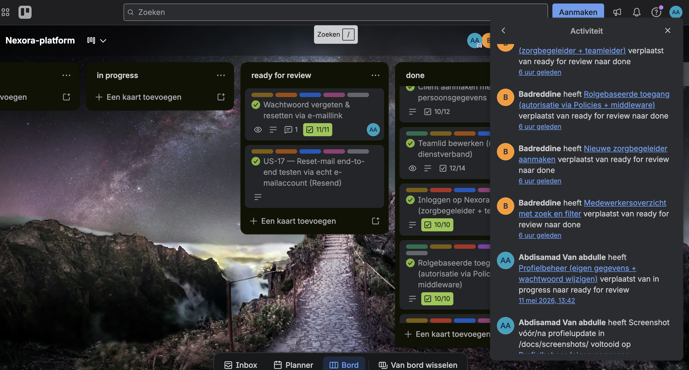
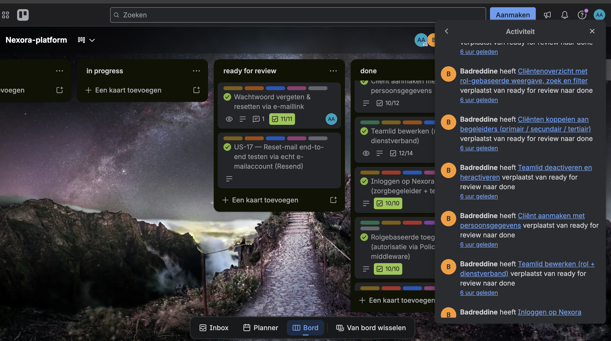
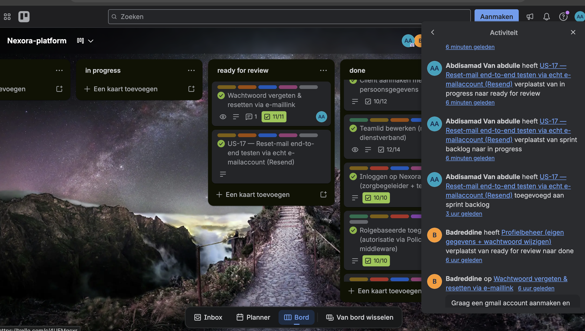

# Opdracht 5 — Overleggen (B1-K2-W1)

> **Werkproces:** B1-K2-W1 — *Voert overleg*
> **Datum:** 2026-05-12
> **Sprint-context:** Sprint 1 t/m 4 afgerond (alle 16 user stories door PO Badreddine geaccepteerd), plus US-17 (verbetervoorstel uit Opdracht 4) toegevoegd en uitgevoerd.

Dit document bundelt de bewijslast voor werkproces **B1-K2-W1 — Voert overleg**: wanneer overleggen plaatsvonden, met wie, hoe afspraken zijn vastgelegd en welke activiteiten daaruit zijn voortgekomen. De screenshots in deze map tonen het Trello-activiteitenlog waarin de samenwerking met product owner **Badreddine** zichtbaar is — kaarten die hij van *ready for review* naar *done* heeft verplaatst en de PO-comment op US-15 die heeft geleid tot US-17.

---

## 1. Overlegstructuur

| Overlegtype | Frequentie | Deelnemers | Kanaal | Doel |
|---|---|---|---|---|
| **Dagelijkse check-in** | Werkdagelijks | Abdisamad + PO Badreddine | Zoom / in persoon | Voortgang, knelpunten, dagplanning bespreken |
| **Sprint-review** | Einde van elke sprint (4×) | Abdisamad + PO Badreddine | Zoom + Trello-bord | Demo opgeleverde user stories, PO verplaatst kaarten *ready for review* → *done* of geeft feedback |
| **Sprint-retrospective** | Einde van elke sprint (4×) | Abdisamad (solo) | Notitie in projectverslag | "Wat ging goed / wat anders" vastleggen → input voor volgende sprint |
| **Ad-hoc PO-feedback** | Wanneer nodig | Abdisamad + PO Badreddine | Trello-comments op kaarten | Tussentijdse vragen, verbeterpunten en akkoord op gewijzigde scope |
| **Trello-update (asynchroon)** | Werkdagelijks | Abdisamad | Trello-scrumboard | Kaarten verplaatsen tussen lijsten (*sprint backlog* → *in progress* → *ready for review*) zodat PO realtime de stand ziet |

Omdat ik als enige ontwikkelaar aan Nexora werk, is de **PO de vaste overleg-partner**. Er is geen development-team en dus ook geen dagelijkse stand-up met meerdere developers — de equivalente afstemming gebeurt 1-op-1 met de PO én via het Trello-activiteitenlog.

---

## 2. Vastlegging van afspraken

| Type afspraak | Waar vastgelegd | Voorbeeld |
|---|---|---|
| **Taken & voortgang** | Direct op het **Trello-scrumboard** (kaarten verplaatsen, labels, tijdsinschatting in beschrijving) | Iedere US-kaart heeft labels *Sprint N · MoSCoW · domein · User Story* en doorloopt de lijsten *sprint backlog* → *in progress* → *ready for review* → *done* |
| **Sprint-screenshots bord** | [`docs/sprint-backlog-screenshots/`](../sprint-backlog-screenshots/) | Per sprint een aparte map (`begin-sprint`, `sprint1`, `sprint 2`, `sprint 3`) met snapshots voor en na |
| **Trello-activiteitenlog (samenwerking met PO)** | Deze map (`docs/overleggen/`) | De drie screenshots in §3 hieronder |
| **Technische / inhoudelijke afspraken** | [`docs/projectverslag.md`](../projectverslag.md) — vooral §5 (sprint-overzichten) en §11 (reflectie) | Keuze om mail-driver van `log` → `resend` te zetten n.a.v. PO-feedback US-15 |
| **PO-feedback comments** | Blijven zichtbaar op de Trello-kaart zelf én verwerkt in een verbetervoorstel | Comment Badreddine op US-15 → [opdracht-4-verbetervoorstellen/README.md](../uitgewerkte-functionaliteiten/opdracht-4-verbetervoorstellen/README.md) |
| **Definition of Done** | [`docs/definition-of-done.md`](../definition-of-done.md) | Vaste werkafspraak die elke US moet halen voor PO de kaart accepteert |

---

## 3. Bewijslast — screenshots Trello-activiteitenlog

De drie onderstaande screenshots zijn afkomstig uit het **Trello-activiteitenlog** van het bord *Nexora-platform*. Het log toont chronologisch wie wat heeft gedaan — daarmee is de samenwerking met PO Badreddine **objectief aantoonbaar**.

*Schermafbeelding 1 — Trello-activiteitenlog (kolom rechts). **Badreddine (PO)** verplaatst meerdere kaarten van *ready for review* → *done*: o.a. "Rolgebaseerde toegang (autorisatie via Policies + middleware)", "Nieuwe zorgbegeleider toevoegen", "Medewerkersoverzicht met zoek en filter". Bewijst dat de PO actief sprint-reviews uitvoert en formeel akkoord geeft op opgeleverde user stories.*

*Schermafbeelding 2 — Vervolg van het activiteitenlog. **Badreddine** verplaatst nog meer kaarten naar *done*: "Cliëntenoverzicht met rol-gebaseerde weergave, zoek en filter", "Cliënten koppelen aan begeleiders (primair/secundair/tertiair)", "Teamlid deactiveren en heractiveren", "Cliënt aanmaken met persoonsgegevens", "Teamlid bewerken (rol + dienstverband)", "Inloggen op Nexora". Dit is de tweede batch sprint-review-acties van de PO en bewijst dat álle 16 user stories formeel door hem zijn geaccepteerd.*

*Schermafbeelding 3 — Activiteitenlog toont de **volledige lifecycle van US-17** (toegevoegd aan sprint backlog → in progress → ready for review, allemaal door **Abdisamad**) én onderaan de oorspronkelijke **PO-comment van Badreddine** op de US-15-kaart: *"Graag een gmail account aanmaken..."*. Deze ene screenshot bewijst de gesloten feedback-loop: een afspraak uit het overleg (PO-comment) → opgepakt als nieuwe user story → uitgevoerd → klaar voor review. Dat is precies wat B1-K2-W1 vraagt: actief deelnemen aan overleggen én je houden aan gemaakte afspraken.*

---

## 4. Uitgevoerde activiteiten op basis van gemaakte afspraken

| # | Afspraak / overleg-uitkomst | Uitgevoerde actie | Bewijs |
|---|---|---|---|
| 1 | **Sprint-review:** alle 16 user stories moeten door PO geaccepteerd worden vóór ze naar *done* gaan | Per US: kaart naar *ready for review* gezet, PO heeft kaart verplaatst naar *done* (of feedback gegeven) | Schermafbeelding 1 + 2 — Badreddine verplaatste 9+ kaarten zelf naar *done* |
| 2 | **PO-comment US-15** (Trello): *"Graag een gmail account aanmaken en deze als account opvoeren in het platform om te testen of het reset-my-password mailtje ook aankomt. Je kunt kijken naar SendGrid of Resend."* | US-17 aangemaakt op sprint backlog, Resend geïntegreerd, mail end-to-end getest in echte Gmail-inbox | Schermafbeelding 3 + [opdracht-4-verbetervoorstellen/README.md](../uitgewerkte-functionaliteiten/opdracht-4-verbetervoorstellen/README.md) |
| 3 | **Werkafspraak:** dagelijkse update op Trello-scrumboard zodat PO realtime de stand kan zien | Kaarten zijn dagelijks verplaatst tussen *sprint backlog* / *in progress* / *ready for review*; per sprint snapshot opgeslagen | [`docs/sprint-backlog-screenshots/`](../sprint-backlog-screenshots/) |
| 4 | **Retrospective Sprint 1:** Definition of Done uitbreiden met "mail-/notificatie-flows handmatig gevalideerd in echte inbox" | DoD-werkafspraak vastgelegd in projectverslag §11 + meteen toegepast op US-17 | [`docs/projectverslag.md`](../projectverslag.md) §11 + [`docs/definition-of-done.md`](../definition-of-done.md) |
| 5 | **Sprint-planning** (PO + Abdisamad): sprintdoelen vastleggen voor Sprint 1 t/m 4 | Per sprint een sectie in projectverslag §5 met sprintdoel, opgeleverde US's en evt. verschuivingen | [`docs/projectverslag.md`](../projectverslag.md) §5 |

---

## 5. Koppeling met examen-rubric (B1-K2-W1)

| Rubric-item | Bewijs in deze documentatie |
|---|---|
| Wanneer en met wie vinden de overlegmomenten plaats? | §1 — Overlegstructuur (tabel met overlegtype × frequentie × deelnemers) |
| Hoe worden afspraken uit de overleggen vastgelegd? | §2 — Vastlegging van afspraken (Trello + projectverslag + DoD + activiteitenlog) |
| Actieve deelname aan overleggen | §3 + §4 — Activiteitenlog laat zien dat ik dagelijks kaarten verplaats én dat PO sprint-reviews uitvoert; US-17 lifecycle bewijst dat ik handel naar PO-feedback |
| Afstemming met opdrachtgever (PO) | Schermafbeelding 1 + 2 — PO Badreddine als actor zichtbaar in het log; Schermafbeelding 3 — PO-comment + opvolging |
| Houdt zich aan gemaakte afspraken | §4 — Tabel met afspraak → actie → bewijs (links naar geleverde US-readmes, opdracht-4-README en projectverslag-secties) |
| Resultaten in *Examenverslag* in `/docs` | Dit document + verwijzing in [projectverslag.md](../projectverslag.md) |
