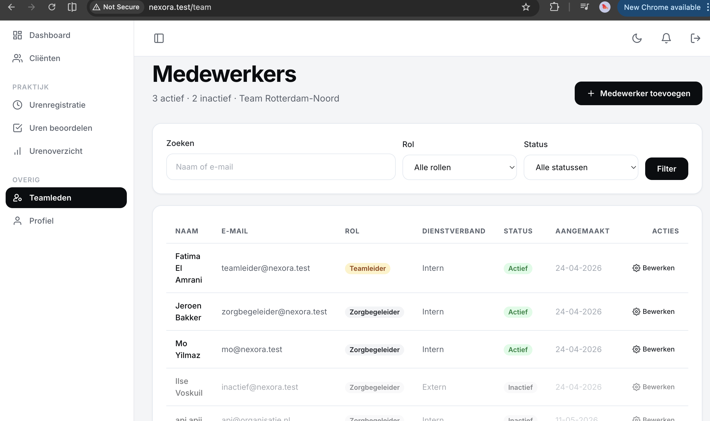

# US-04 — Medewerkersoverzicht met zoek en filter — Uitwerking

> **User story:** Als teamleider wil ik een overzicht van alle medewerkers in mijn team kunnen bekijken, kunnen zoeken op naam/e-mail en filteren op rol en status (actief/inactief), zodat ik snel het juiste teamlid terugvind.

Gerelateerd: [testplan](../../testplan/US04-medewerkers-overzicht.md) · [user stories](../../user-stories.md)

---

## Functionaliteit

- `/team` — overzichtspagina (alleen teamleider, policy `viewAny`)
- Header toont actuele tellers: "X actief · Y inactief · Teamnaam"
- Zoekveld matched op naam **of** e-mail (case-insensitive `LIKE %...%`)
- Filter op rol (Teamleider / Zorgbegeleider) via `Rule::in`-whitelist
- Filter op status (Actief / Inactief) via `is_active` boolean
- Filters zijn **combineerbaar** — alle filters in dezelfde GET-request
- `team_id`-scope: teamleider ziet **alleen** medewerkers van eigen team
- Sortering: actieve users bovenaan, daarna alfabetisch op naam
- Pagination: 25 per pagina via `paginate()->withQueryString()` (filters blijven behouden)
- XSS-bescherming: Blade escapet alle output (`{{ }}`) — geen `{!! !!}`
- Zorgbegeleider → 403 op `/team`

---

## Screenshots functionaliteit



*/team overzicht met filters en 4 medewerkers*

---

## Code uitwerking

### Route — [`routes/web.php`](../../../routes/web.php)

```php
Route::middleware('teamleider')->group(function () {
    Route::get('/team', [TeamController::class, 'index'])->name('team.index');
});
```

### Controller — [`app/Http/Controllers/TeamController.php`](../../../app/Http/Controllers/TeamController.php)

```php
public function index(Request $request): View
{
    $this->authorize('viewAny', User::class);

    $search = trim((string) $request->query('search', ''));
    $role = $request->query('role');
    $status = $request->query('status');

    $query = User::query()
        ->where('team_id', auth()->user()->team_id);

    if ($search !== '') {
        $query->where(function (Builder $q) use ($search) {
            $q->where('name', 'like', "%{$search}%")
                ->orWhere('email', 'like', "%{$search}%");
        });
    }

    if (in_array($role, [User::ROLE_ZORGBEGELEIDER, User::ROLE_TEAMLEIDER], true)) {
        $query->where('role', $role);
    }

    if ($status === 'actief') {
        $query->where('is_active', true);
    } elseif ($status === 'inactief') {
        $query->where('is_active', false);
    }

    $query->orderByDesc('is_active')->orderBy('name');

    $members = $query->paginate(25)->withQueryString();

    $totals = [
        'actief' => User::where('team_id', auth()->user()->team_id)->where('is_active', true)->count(),
        'inactief' => User::where('team_id', auth()->user()->team_id)->where('is_active', false)->count(),
    ];

    return view('team.index', [
        'members' => $members,
        'totals' => $totals,
        'filters' => compact('search', 'role', 'status'),
    ]);
}
```

### Policy — [`app/Policies/UserPolicy.php`](../../../app/Policies/UserPolicy.php)

```php
public function viewAny(User $user): bool
{
    return $user->is_active && $user->isTeamleider();
}
```

### View — [`resources/views/team/index.blade.php`](../../../resources/views/team/index.blade.php)

```blade
<h1 class="page-title">Medewerkers</h1>
<p class="page-subtitle">
    {{ $totals['actief'] }} actief · {{ $totals['inactief'] }} inactief
    @if($user->team)
        · {{ $user->team->name }}
    @endif
</p>

<form method="GET" action="{{ route('team.index') }}">
    <input type="search" name="search" value="{{ $filters['search'] }}" placeholder="Naam of e-mail">

    <select name="role">
        <option value="">Alle rollen</option>
        <option value="teamleider" {{ $filters['role'] === 'teamleider' ? 'selected' : '' }}>Teamleider</option>
        <option value="zorgbegeleider" {{ $filters['role'] === 'zorgbegeleider' ? 'selected' : '' }}>Zorgbegeleider</option>
    </select>

    <select name="status">
        <option value="">Alle statussen</option>
        <option value="actief" {{ $filters['status'] === 'actief' ? 'selected' : '' }}>Actief</option>
        <option value="inactief" {{ $filters['status'] === 'inactief' ? 'selected' : '' }}>Inactief</option>
    </select>
</form>

{{-- Tabel met members, paginatie onderaan --}}
{{ $members->links() }}
```

---

## Testgebruikers (seeders)

| E-mail | Wachtwoord | Rol |
|---|---|---|
| `teamleider@nexora.test` | `password` | teamleider |
| `zorgbegeleider@nexora.test` | `password` | zorgbegeleider (voor 403 test) |

Setup: `php artisan migrate:fresh --seed` · URL: [http://nexora.test/team](http://nexora.test/team) (als teamleider)

### Paginatie-data genereren

```bash
php artisan tinker
>>> App\Models\User::factory()->count(30)->zorgbegeleider()->create(['team_id' => 1, 'dienstverband' => 'intern']);
```
