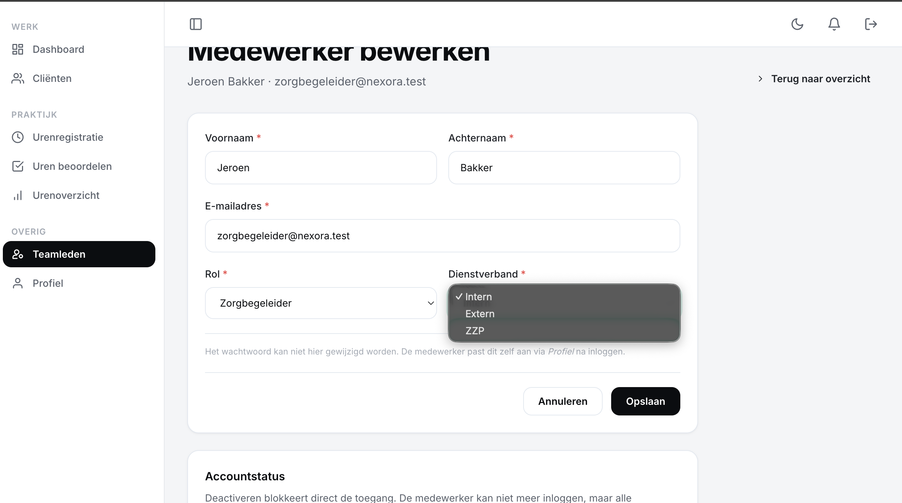

# US-05 — Teamlid bewerken (rol + dienstverband) — Uitwerking

> **User story:** Als teamleider wil ik de gegevens (naam, e-mail, rol, dienstverband) van een medewerker uit mijn team kunnen aanpassen, zodat ik foutieve invoer of organisatiewijzigingen kan verwerken — met een audit-trail per veldwijziging.

Gerelateerd: [testplan](../../testplan/US05-teamlid-bewerken.md) · [user stories](../../user-stories.md)

---

## Functionaliteit

- `/team/{user}/edit` — alleen teamleider van eigen team (policy `update`)
- Velden bewerkbaar: voornaam, achternaam, e-mail, rol, dienstverband (geen wachtwoord — valt onder US-16)
- Validatie via `UpdateTeamMemberRequest` met `Rule::unique` die eigen e-mail mag behouden
- Mutaties lopen via `UserService::updateWithAudit()` — DB-transactie + audit-log per veld
- **Audit-log**: voor elk gewijzigd veld een rij in `user_audit_logs` (user_id, changed_by, field, old, new)
- **Self-demotion guard**: enige teamleider kan eigen rol niet wijzigen → validatie-error op `role`
- Audit-trail opvraagbaar via `$user->auditLogs` relatie (geordend op `created_at DESC`)

---

## Screenshots functionaliteit



*Edit-formulier voor een teamlid met voorgevulde velden*

---

## Code uitwerking

### Routes — [`routes/web.php`](../../../routes/web.php)

```php
Route::middleware('teamleider')->group(function () {
    Route::get('/team/{user}/edit', [TeamController::class, 'edit'])->name('team.edit');
    Route::put('/team/{user}', [TeamController::class, 'update'])->name('team.update');
});
```

### Controller — [`app/Http/Controllers/TeamController.php`](../../../app/Http/Controllers/TeamController.php)

```php
public function edit(User $user): View
{
    $this->authorize('update', $user);

    return view('team.edit', ['member' => $user]);
}

public function update(UpdateTeamMemberRequest $request, User $user, UserService $users): RedirectResponse
{
    $users->updateWithAudit(
        member: $user,
        payload: $request->validatedPayload(),
        changedBy: $request->user(),
    );

    return redirect()
        ->route('team.index')
        ->with('success', 'Medewerker bijgewerkt.');
}
```

### Validatie — [`app/Http/Requests/Team/UpdateTeamMemberRequest.php`](../../../app/Http/Requests/Team/UpdateTeamMemberRequest.php)

```php
public function rules(): array
{
    /** @var User $target */
    $target = $this->route('user');

    return [
        'voornaam' => ['required', 'string', 'max:255'],
        'achternaam' => ['required', 'string', 'max:255'],
        'email' => [
            'required', 'string', 'email', 'max:255',
            Rule::unique('users', 'email')->ignore($target->id),
        ],
        'role' => ['required', Rule::in([User::ROLE_ZORGBEGELEIDER, User::ROLE_TEAMLEIDER])],
        'dienstverband' => ['required', Rule::in(['intern', 'extern', 'zzp'])],
    ];
}
```

### Service met audit-log — [`app/Services/UserService.php`](../../../app/Services/UserService.php)

```php
public function updateWithAudit(User $member, array $payload, User $changedBy): User
{
    $this->ensureTeamRetainsTeamleider($member, $payload, $changedBy);

    $auditable = ['name', 'email', 'role', 'dienstverband'];

    return DB::transaction(function () use ($member, $payload, $changedBy, $auditable) {
        foreach ($auditable as $field) {
            if (!array_key_exists($field, $payload)) {
                continue;
            }

            $old = $member->getOriginal($field);
            $new = $payload[$field];

            if ((string) $old === (string) $new) {
                continue;
            }

            UserAuditLog::create([
                'user_id' => $member->id,
                'changed_by_user_id' => $changedBy->id,
                'field' => $field,
                'old_value' => $old,
                'new_value' => $new,
            ]);

            $member->{$field} = $new;
        }

        $member->save();

        return $member;
    });
}
```

### Self-demotion guard — [`app/Services/UserService.php`](../../../app/Services/UserService.php)

```php
protected function ensureTeamRetainsTeamleider(User $member, array $payload, User $changedBy): void
{
    $isSelfEdit = $member->id === $changedBy->id;
    $wasTeamleider = $member->role === User::ROLE_TEAMLEIDER;
    $newRole = $payload['role'] ?? $member->role;
    $becomesZorgbegeleider = $newRole !== User::ROLE_TEAMLEIDER;

    if (!($isSelfEdit && $wasTeamleider && $becomesZorgbegeleider)) {
        return;
    }

    $otherActiveTeamleidersInTeam = User::query()
        ->where('team_id', $member->team_id)
        ->where('id', '!=', $member->id)
        ->where('role', User::ROLE_TEAMLEIDER)
        ->where('is_active', true)
        ->count();

    if ($otherActiveTeamleidersInTeam === 0) {
        throw ValidationException::withMessages([
            'role' => 'Je kunt je eigen teamleider-rol niet verwijderen zolang je de enige teamleider van je team bent.',
        ]);
    }
}
```

### Audit-log relatie — [`app/Models/User.php`](../../../app/Models/User.php)

```php
public function auditLogs(): HasMany
{
    return $this->hasMany(UserAuditLog::class)->orderByDesc('created_at');
}
```

---

## Testgebruikers (seeders)

| E-mail | Wachtwoord | Rol |
|---|---|---|
| `teamleider@nexora.test` | `password` | teamleider |
| `zorgbegeleider@nexora.test` | `password` | zorgbegeleider |

Setup: `php artisan migrate:fresh --seed` · URL: [http://nexora.test/team](http://nexora.test/team)

### Audit-log opvragen via tinker

```bash
php artisan tinker
>>> $jeroen = App\Models\User::where('email', 'zorgbegeleider@nexora.test')->first();
>>> $jeroen->auditLogs()->get(['field', 'old_value', 'new_value', 'changed_by_user_id', 'created_at']);
```
