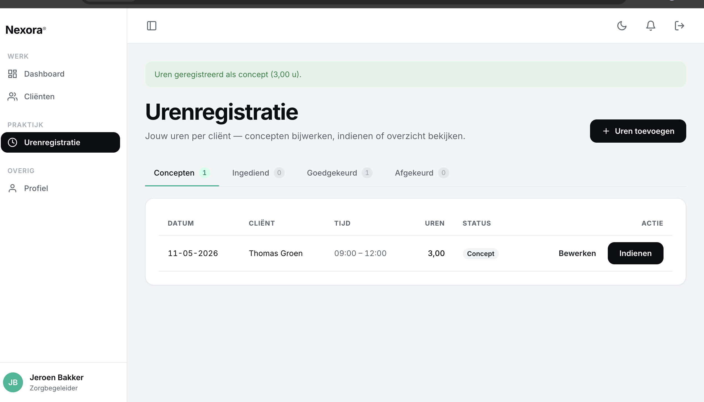

# US-11 — Concept-uren aanmaken en bewerken — Uitwerking

> **User story:** Als zorgbegeleider wil ik uren kunnen registreren per cliënt uit mijn caseload (datum, starttijd, eindtijd, optionele notities), zodat ik aan het einde van de week mijn werk kan declareren. Een nieuwe entry start als **concept** en is bewerkbaar.

Gerelateerd: [testplan](../../testplan/US11-concept-uren-aanmaken.md) · [user stories](../../user-stories.md)

---

## Functionaliteit

- `/uren/create` — alleen zorgbegeleider (policy `create` op Urenregistratie)
- Cliëntenkeuze: alleen cliënten waar de user via `client_caregivers` aan gekoppeld is
- **Defense-in-depth**: server-side `client_id` controleert `ownCaregiverClients()` opnieuw
- Validatie:
  - `datum` verplicht, `before_or_equal:today` (geen toekomst)
  - `starttijd`/`eindtijd` `H:i`-format, eind > start
  - `notities` optioneel, max 2000 tekens
- `computeDuration()` berekent decimale uren uit HH:MM via integer-seconds (geen float-wobble)
- Status wordt altijd op `Concept` gezet bij create
- Status-machine voor transitions (US-12) — Concept kan bewerkt worden
- Bewerken/verwijderen alleen toegestaan bij status `Concept` of `Afgekeurd`

---

## Screenshots functionaliteit



*/uren/create formulier voor concept-uren*

---

## Code uitwerking

### Routes — [`routes/web.php`](../../../routes/web.php)

```php
Route::middleware('zorgbegeleider')->group(function () {
    Route::get('/uren', [UrenregistratieController::class, 'index'])->name('uren.index');
    Route::get('/uren/create', [UrenregistratieController::class, 'create'])->name('uren.create');
    Route::post('/uren', [UrenregistratieController::class, 'store'])->name('uren.store');
    Route::get('/uren/{uren}/edit', [UrenregistratieController::class, 'edit'])->name('uren.edit');
    Route::put('/uren/{uren}', [UrenregistratieController::class, 'update'])->name('uren.update');
});
```

### Controller — [`app/Http/Controllers/UrenregistratieController.php`](../../../app/Http/Controllers/UrenregistratieController.php)

```php
public function create(): View
{
    $this->authorize('create', Urenregistratie::class);

    return view('uren.create', [
        'clients' => $this->ownCaregiverClients(),
    ]);
}

public function store(StoreUrenregistratieRequest $request): RedirectResponse
{
    $user = $request->user();
    $payload = $request->validatedPayload();

    // Defense in depth: cliënt moet aan deze zorgbegeleider gekoppeld zijn.
    if (!$this->ownCaregiverClients()->contains('id', $payload['client_id'])) {
        abort(403, 'Deze cliënt hoort niet bij jouw caseload.');
    }

    $uren = $this->uren->create($user, $payload);

    return redirect()
        ->route('uren.index', ['status' => UrenStatus::Concept->value])
        ->with('success', 'Uren geregistreerd als concept ('.number_format($uren->uren, 2, ',', '').' u).');
}
```

### Validatie — [`app/Http/Requests/Uren/StoreUrenregistratieRequest.php`](../../../app/Http/Requests/Uren/StoreUrenregistratieRequest.php)

```php
public function rules(): array
{
    return [
        'client_id' => ['required', 'integer', Rule::exists('clients', 'id')],
        'datum' => ['required', 'date', 'before_or_equal:today'],
        'starttijd' => ['required', 'date_format:H:i'],
        'eindtijd' => ['required', 'date_format:H:i', 'after:starttijd'],
        'notities' => ['nullable', 'string', 'max:2000'],
    ];
}

public function validatedPayload(): array
{
    $data = $this->validated();

    return [
        'client_id' => (int) $data['client_id'],
        'datum' => $data['datum'],
        'starttijd' => $data['starttijd'].':00',
        'eindtijd' => $data['eindtijd'].':00',
        'notities' => $data['notities'] ?? null,
    ];
}
```

### Service — duur-berekening + create — [`app/Services/UrenregistratieService.php`](../../../app/Services/UrenregistratieService.php)

```php
public function computeDuration(string $starttijd, string $eindtijd): float
{
    $start = strtotime('1970-01-01 '.$starttijd);
    $eind = strtotime('1970-01-01 '.$eindtijd);

    if ($eind <= $start) {
        return 0.0;
    }

    return round(($eind - $start) / 3600, 2);
}

public function create(User $user, array $payload): Urenregistratie
{
    return DB::transaction(function () use ($user, $payload) {
        $uren = new Urenregistratie();
        $uren->user_id = $user->id;
        $uren->client_id = $payload['client_id'];
        $uren->datum = $payload['datum'];
        $uren->starttijd = $payload['starttijd'];
        $uren->eindtijd = $payload['eindtijd'];
        $uren->uren = $this->computeDuration($payload['starttijd'], $payload['eindtijd']);
        $uren->notities = $payload['notities'] ?? null;
        $uren->status = UrenStatus::Concept;
        $uren->save();

        return $uren;
    });
}

public function update(Urenregistratie $uren, array $payload): void
{
    DB::transaction(function () use ($uren, $payload) {
        $uren->client_id = $payload['client_id'];
        $uren->datum = $payload['datum'];
        $uren->starttijd = $payload['starttijd'];
        $uren->eindtijd = $payload['eindtijd'];
        $uren->uren = $this->computeDuration($payload['starttijd'], $payload['eindtijd']);
        $uren->notities = $payload['notities'] ?? null;
        $uren->save();
    });
}
```

### Caregiver-scope helper — [`app/Http/Controllers/UrenregistratieController.php`](../../../app/Http/Controllers/UrenregistratieController.php)

```php
protected function ownCaregiverClients(): \Illuminate\Support\Collection
{
    return auth()->user()
        ->caregiverClients()
        ->where('clients.deleted_at', null)
        ->orderBy('achternaam')
        ->orderBy('voornaam')
        ->get();
}
```

---

## Testgebruikers (seeders)

| E-mail | Wachtwoord | Rol | Caseload |
|---|---|---|---|
| `zorgbegeleider@nexora.test` | `password` | zorgbegeleider | 2-3 cliënten |
| `mo@nexora.test` | `password` | zorgbegeleider | andere cliënten (voor 403-test) |

Setup: `php artisan migrate:fresh --seed` · URL: [http://nexora.test/uren/create](http://nexora.test/uren/create)
