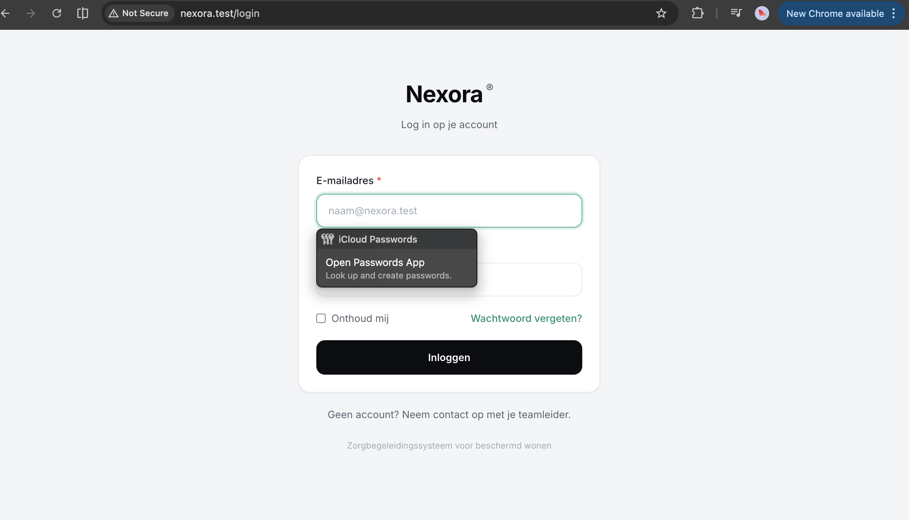

# US-01 — Inloggen — Uitwerking

> **User story:** Als gebruiker (zorgbegeleider of teamleider) wil ik kunnen inloggen op Nexora met mijn e-mailadres en wachtwoord, zodat ik toegang krijg tot de functionaliteit die bij mijn rol hoort.

Gerelateerd: [testplan](../../testplan/US01-inloggen.md) · [user stories](../../user-stories.md)

---

## Functionaliteit

- `/login` route toont het inlogformulier (e-mail + wachtwoord + "onthoud mij")
- Validatie van invoer via `LoginRequest` (e-mail-formaat, verplichte velden)
- Verkeerde credentials geven generieke foutmelding (`"De ingevoerde gegevens zijn onjuist."`)
- Gedeactiveerd account (`is_active = false`) krijgt aparte foutmelding
- Rate limiting: 5 pogingen per `email + IP` combinatie
- Na succesvolle login: redirect op basis van rol (`teamleider` → teamleider-dashboard, anders → zorgbegeleider-dashboard)
- Session regeneratie tegen session-fixation
- Uitloggen via POST `/logout` — sessie wordt vernietigd en token geregenereerd

---

## Screenshots functionaliteit



*Inlogformulier op /login*

---

## Code uitwerking

### Route — [`routes/web.php`](../../../routes/web.php)

```php
Route::get('/login', [LoginController::class, 'show'])->name('login');
Route::post('/login', [LoginController::class, 'store'])
    ->middleware('throttle:login')
    ->name('login.store');

Route::middleware('auth')->group(function () {
    Route::post('/logout', [LoginController::class, 'destroy'])->name('logout');
});
```

### Controller — [`app/Http/Controllers/Auth/LoginController.php`](../../../app/Http/Controllers/Auth/LoginController.php)

```php
public function store(LoginRequest $request): RedirectResponse
{
    $this->ensureIsNotRateLimited($request);

    $credentials = $request->only('email', 'password');
    $user = User::where('email', $credentials['email'])->first();

    if (!$user || !Hash::check($credentials['password'], $user->password)) {
        RateLimiter::hit($this->throttleKey($request));
        throw ValidationException::withMessages([
            'email' => __('De ingevoerde gegevens zijn onjuist.'),
        ])->redirectTo(route('login'));
    }

    if (!$user->is_active) {
        throw ValidationException::withMessages([
            'email' => __('Dit account is gedeactiveerd. Neem contact op met je teamleider.'),
        ])->redirectTo(route('login'));
    }

    Auth::login($user, $request->boolean('remember'));
    $request->session()->regenerate();
    RateLimiter::clear($this->throttleKey($request));

    return $this->redirectByRole($user);
}

protected function redirectByRole(User $user): RedirectResponse
{
    return $user->isTeamleider()
        ? redirect()->route('teamleider.dashboard')
        : redirect()->route('dashboard');
}
```

### Validatie — [`app/Http/Requests/Auth/LoginRequest.php`](../../../app/Http/Requests/Auth/LoginRequest.php)

```php
public function rules(): array
{
    return [
        'email' => ['required', 'string', 'email', 'max:255'],
        'password' => ['required', 'string', 'max:255'],
    ];
}

public function messages(): array
{
    return [
        'email.required' => 'Vul je e-mailadres in.',
        'email.email' => 'Dit is geen geldig e-mailadres.',
        'password.required' => 'Vul je wachtwoord in.',
    ];
}
```

### View — [`resources/views/auth/login.blade.php`](../../../resources/views/auth/login.blade.php)

Blade-template met e-mail/wachtwoord velden, "onthoud mij" checkbox, link naar wachtwoord-vergeten, en CSRF-token.

---

## Testgebruikers (seeders)

| E-mail | Wachtwoord | Rol |
|---|---|---|
| `zorgbegeleider@nexora.test` | `password` | zorgbegeleider |
| `claudeabdi+teamleider@gmail.com` | `password` | teamleider |
| `inactief@nexora.test` | `password` | zorgbegeleider (`is_active=false`) |

Setup: `php artisan migrate:fresh --seed` · URL: [http://nexora.test/login](http://nexora.test/login)
