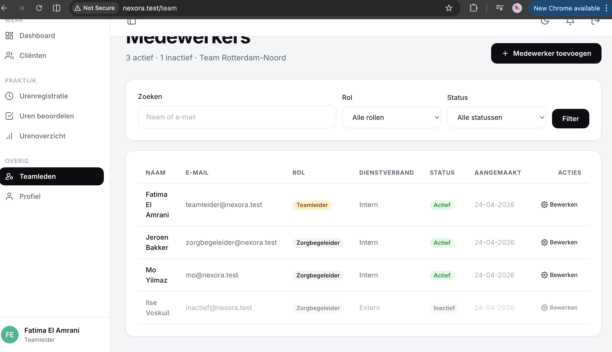
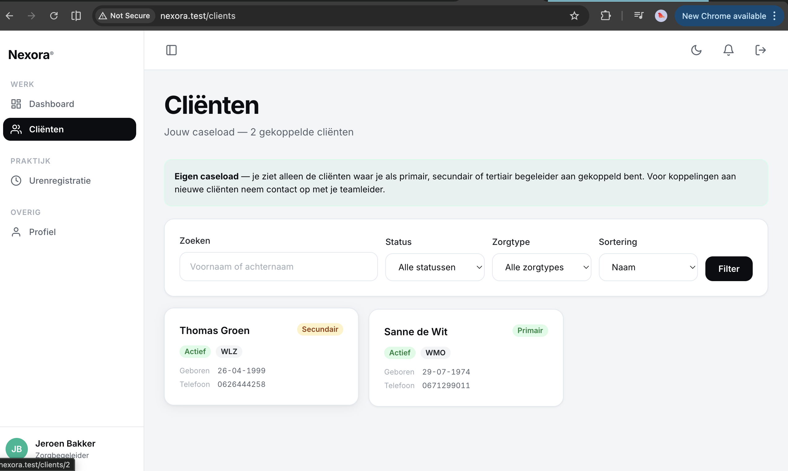

# US-02 — Rolgebaseerde toegang — Uitwerking

> **User story:** Als systeem wil ik dat elke route en actie afgeschermd is op basis van rol (zorgbegeleider vs. teamleider), zodat gebruikers alleen functionaliteit zien die bij hun rol hoort.

Gerelateerd: [testplan](../../testplan/US02-rolgebaseerde-toegang.md) · [user stories](../../user-stories.md)

---

## Functionaliteit

- Twee middleware-aliassen: `teamleider` en `zorgbegeleider` — guarden hele route-groepen
- `CheckActiveUser` middleware logt een gedeactiveerde user automatisch uit bij volgende request
- Policies (`UserPolicy`, `ClientPolicy`, `UrenregistratiePolicy`) regelen autorisatie per resource
- `team_id`-scope: teamleider ziet alleen data van eigen team; zorgbegeleider ziet alleen eigen toewijzingen
- Self-demotion guard: teamleider kan zichzelf niet downgraden of deactiveren
- Guests krijgen 302 → `/login`, ingelogde users met verkeerde rol krijgen 403

---

## Screenshots functionaliteit



*Teamleider-dashboard met rolgebaseerde menu's*



*Zorgbegeleider krijgt 403 bij /teamleider/dashboard*

---

## Code uitwerking

### Middleware-registratie — [`bootstrap/app.php`](../../../bootstrap/app.php)

```php
->withMiddleware(function (Middleware $middleware) {
    $middleware->alias([
        'teamleider' => EnsureTeamleider::class,
        'zorgbegeleider' => EnsureZorgbegeleider::class,
    ]);

    $middleware->web(append: [
        CheckActiveUser::class,
    ]);
})
```

### Middleware — [`app/Http/Middleware/EnsureTeamleider.php`](../../../app/Http/Middleware/EnsureTeamleider.php)

```php
public function handle(Request $request, Closure $next): Response
{
    if (!$request->user() || !$request->user()->isTeamleider()) {
        abort(403);
    }

    return $next($request);
}
```

### Middleware — [`app/Http/Middleware/EnsureZorgbegeleider.php`](../../../app/Http/Middleware/EnsureZorgbegeleider.php)

```php
public function handle(Request $request, Closure $next): Response
{
    if (!$request->user() || !$request->user()->isZorgbegeleider()) {
        abort(403);
    }

    return $next($request);
}
```

### Middleware — [`app/Http/Middleware/CheckActiveUser.php`](../../../app/Http/Middleware/CheckActiveUser.php)

```php
public function handle(Request $request, Closure $next): Response
{
    $user = $request->user();

    if ($user && !$user->is_active) {
        Auth::guard('web')->logout();
        $request->session()->invalidate();
        $request->session()->regenerateToken();

        return redirect()
            ->route('login')
            ->withErrors(['email' => 'Dit account is gedeactiveerd. Neem contact op met je teamleider.']);
    }

    return $next($request);
}
```

### Route-groepen — [`routes/web.php`](../../../routes/web.php)

```php
Route::middleware('auth')->group(function () {
    Route::post('/logout', [LoginController::class, 'destroy'])->name('logout');

    Route::middleware('zorgbegeleider')->group(function () {
        Route::get('/dashboard', [DashboardController::class, 'index'])->name('dashboard');
        // ...
    });

    Route::middleware('teamleider')->prefix('teamleider')->name('teamleider.')->group(function () {
        Route::get('/dashboard', [TeamleiderDashboardController::class, 'index'])->name('dashboard');
        // ...
    });
});
```

### Rol-helpers — [`app/Models/User.php`](../../../app/Models/User.php)

```php
public function isTeamleider(): bool
{
    return $this->role === self::ROLE_TEAMLEIDER;
}

public function isZorgbegeleider(): bool
{
    return $this->role === self::ROLE_ZORGBEGELEIDER;
}
```

### Policy — [`app/Policies/UserPolicy.php`](../../../app/Policies/UserPolicy.php)

```php
public function viewAny(User $user): bool
{
    return $user->is_active && $user->isTeamleider();
}

public function update(User $user, User $model): bool
{
    return $user->is_active
        && $user->isTeamleider()
        && $user->team_id === $model->team_id;
}

public function delete(User $user, User $model): bool
{
    if ($user->id === $model->id) {
        return false;  // self-demotion guard
    }

    return $user->is_active
        && $user->isTeamleider()
        && $user->team_id === $model->team_id;
}
```

---

## Testgebruikers (seeders)

| E-mail | Wachtwoord | Rol | Team |
|---|---|---|---|
| `claudeabdi+tl@gmail.com` | `password` | teamleider | Rotterdam-Noord |
| `zorgbegeleider@nexora.test` | `password` | zorgbegeleider | Rotterdam-Noord |
| `mo@nexora.test` | `password` | zorgbegeleider | Rotterdam-Noord |
| `noa@nexora.test` | `password` | zorgbegeleider | Amsterdam-Zuid |
| `inactief@nexora.test` | `password` | zorgbegeleider | Rotterdam-Noord (`is_active=false`) |

Setup: `php artisan migrate:fresh --seed` · URL: [http://nexora.test](http://nexora.test)
