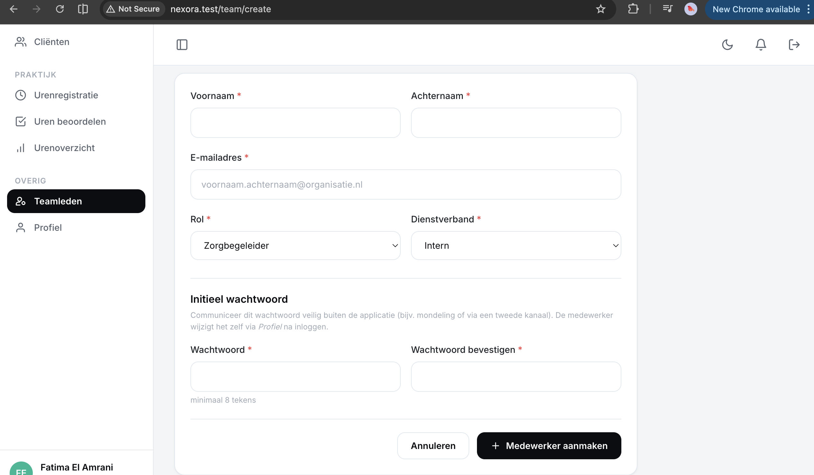

# US-03 — Nieuwe zorgbegeleider aanmaken — Uitwerking

> **User story:** Als teamleider wil ik een nieuwe medewerker (zorgbegeleider of teamleider) kunnen aanmaken met voornaam, achternaam, e-mailadres, rol, dienstverband en initieel wachtwoord, zodat die persoon direct kan inloggen op Nexora.

Gerelateerd: [testplan](../../testplan/US03-medewerker-aanmaken.md) · [user stories](../../user-stories.md)

---

## Functionaliteit

- `/team/create` — formulier alleen toegankelijk voor teamleider (policy `create`)
- Velden: voornaam, achternaam, e-mail, rol, dienstverband (intern/extern/zzp), wachtwoord + bevestiging
- `StoreTeamMemberRequest` valideert alles inclusief unieke e-mail en `Password::min(8)`
- `role` is gewhitelist via `Rule::in(...)` → privilege escalation (`admin`) wordt geweigerd
- `team_id` en `is_active=true` worden server-side gezet via `validatedPayload()` — geen mass-assignment risico
- Wachtwoord wordt automatisch gehashed (`User::casts('hashed')`)
- Voornaam + achternaam worden samengevoegd tot `name`
- Na succes: redirect naar `/team` met flash "Medewerker aangemaakt."

---

## Screenshots functionaliteit



*/team/create formulier met validatie*

---

## Code uitwerking

### Routes — [`routes/web.php`](../../../routes/web.php)

```php
Route::middleware('teamleider')->group(function () {
    Route::get('/team/create', [TeamController::class, 'create'])->name('team.create');
    Route::post('/team', [TeamController::class, 'store'])->name('team.store');
});
```

### Controller — [`app/Http/Controllers/TeamController.php`](../../../app/Http/Controllers/TeamController.php)

```php
public function create(): View
{
    $this->authorize('create', User::class);

    return view('team.create');
}

public function store(StoreTeamMemberRequest $request): RedirectResponse
{
    User::create($request->validatedPayload());

    return redirect()
        ->route('team.index')
        ->with('success', 'Medewerker aangemaakt.');
}
```

### Validatie — [`app/Http/Requests/Team/StoreTeamMemberRequest.php`](../../../app/Http/Requests/Team/StoreTeamMemberRequest.php)

```php
public function authorize(): bool
{
    return $this->user()?->can('create', User::class) ?? false;
}

public function rules(): array
{
    return [
        'voornaam' => ['required', 'string', 'max:255'],
        'achternaam' => ['required', 'string', 'max:255'],
        'email' => ['required', 'string', 'email', 'max:255', 'unique:users,email'],
        'role' => ['required', Rule::in([User::ROLE_ZORGBEGELEIDER, User::ROLE_TEAMLEIDER])],
        'dienstverband' => ['required', Rule::in(['intern', 'extern', 'zzp'])],
        'password' => ['required', 'confirmed', Password::min(8)],
    ];
}

public function validatedPayload(): array
{
    $data = $this->validated();

    return [
        'name' => trim($data['voornaam'].' '.$data['achternaam']),
        'email' => $data['email'],
        'password' => $data['password'], // gehashed via User::casts('hashed')
        'role' => $data['role'],
        'dienstverband' => $data['dienstverband'],
        'team_id' => $this->user()->team_id,
        'is_active' => true,
    ];
}
```

### Policy-check — [`app/Policies/UserPolicy.php`](../../../app/Policies/UserPolicy.php)

```php
public function create(User $user): bool
{
    return $user->is_active && $user->isTeamleider();
}
```

### View — [`resources/views/team/create.blade.php`](../../../resources/views/team/create.blade.php)

Blade-formulier met CSRF-token, alle velden met server-side validatie-foutmeldingen via `@error('veld')` en `old()` voor re-fill na fout.

---

## Testgebruikers (seeders)

| E-mail | Wachtwoord | Rol |
|---|---|---|
| `abdisamadvanabdulle@gmail.com` | `password` | teamleider (Rotterdam-Noord) |
| `zorgbegeleider@nexora.test` | `password` | zorgbegeleider (voor 403 test) |

Setup: `php artisan migrate:fresh --seed` · URL: [http://nexora.test/team/create](http://nexora.test/team/create) (als teamleider)

### Test-data voor nieuwe medewerker

| Veld | Waarde |
|---|---|
| Voornaam | Lisa |
| Achternaam | Van Dijk |
| E-mail | `lisa@nexora.test` |
| Rol | Zorgbegeleider |
| Dienstverband | Intern |
| Wachtwoord | `Geheim123` |

Na create: opnieuw inloggen als `lisa@nexora.test` / `Geheim123` → direct naar `/dashboard`.
