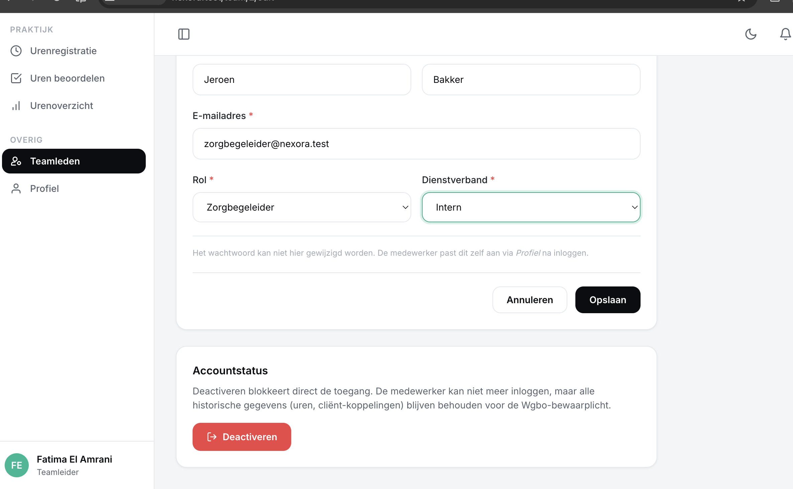

# US-06 — Teamlid deactiveren en heractiveren — Uitwerking

> **User story:** Als teamleider wil ik een medewerker kunnen deactiveren (toegang blokkeren zonder data te verliezen) en later weer kunnen heractiveren, zodat ik kort verlof, ontslag en terugkeer kan verwerken zonder de Wgbo-bewaarplicht te schenden.

Gerelateerd: [testplan](../../testplan/US06-teamlid-deactiveren.md) · [user stories](../../user-stories.md)

---

## Functionaliteit

- **Geen hard delete** — alleen `is_active=false` (Wgbo: 20-jaar dossierbewaarplicht)
- POST `/team/{user}/deactivate` en `/team/{user}/activate` (alleen teamleider)
- Policy `delete` blokkeert self-deactivation én cross-team deactivatie
- Service `UserService::deactivate()` checkt:
  - Niet jezelf deactiveren
  - Niet de enige actieve teamleider van het team
  - Idempotent (al inactief → no-op)
- Audit-log rij bij elke state-wijziging
- `invalidateSessionsFor()` verwijdert openstaande DB-sessies → ander device wordt direct uitgelogd
- `CheckActiveUser` middleware vangt fallback op (file/array session driver)
- Inactieve user → login geweigerd met melding "Dit account is gedeactiveerd"
- Heractivering: wachtwoord blijft staan, user kan direct weer inloggen

---

## Screenshots functionaliteit



*Accountstatus-card met deactiveren/heractiveren-knop*

---

## Code uitwerking

### Routes — [`routes/web.php`](../../../routes/web.php)

```php
Route::middleware('teamleider')->group(function () {
    Route::post('/team/{user}/deactivate', [TeamController::class, 'deactivate'])->name('team.deactivate');
    Route::post('/team/{user}/activate', [TeamController::class, 'activate'])->name('team.activate');
});
```

### Controller — [`app/Http/Controllers/TeamController.php`](../../../app/Http/Controllers/TeamController.php)

```php
public function deactivate(User $user, UserService $users): RedirectResponse
{
    $this->authorize('delete', $user);

    $users->deactivate($user, auth()->user());

    return redirect()
        ->route('team.index')
        ->with('success', "{$user->name} is gedeactiveerd.");
}

public function activate(User $user, UserService $users): RedirectResponse
{
    $this->authorize('restore', $user);

    $users->activate($user, auth()->user());

    return redirect()
        ->route('team.index')
        ->with('success', "{$user->name} is heractiveerd.");
}
```

### Deactiveren-service — [`app/Services/UserService.php`](../../../app/Services/UserService.php)

```php
public function deactivate(User $member, User $changedBy): User
{
    if ($member->id === $changedBy->id) {
        throw ValidationException::withMessages([
            'is_active' => 'Je kunt jezelf niet deactiveren.',
        ]);
    }

    if ($member->isTeamleider()) {
        $otherActive = User::query()
            ->where('team_id', $member->team_id)
            ->where('id', '!=', $member->id)
            ->where('role', User::ROLE_TEAMLEIDER)
            ->where('is_active', true)
            ->count();

        if ($otherActive === 0) {
            throw ValidationException::withMessages([
                'is_active' => 'Je kunt de enige actieve teamleider van het team niet deactiveren.',
            ]);
        }
    }

    if (!$member->is_active) {
        return $member; // idempotent
    }

    return DB::transaction(function () use ($member, $changedBy) {
        UserAuditLog::create([
            'user_id' => $member->id,
            'changed_by_user_id' => $changedBy->id,
            'field' => 'is_active',
            'old_value' => '1',
            'new_value' => '0',
        ]);

        $member->is_active = false;
        $member->save();

        $this->invalidateSessionsFor($member);

        return $member;
    });
}

public function activate(User $member, User $changedBy): User
{
    if ($member->is_active) {
        return $member; // idempotent
    }

    return DB::transaction(function () use ($member, $changedBy) {
        UserAuditLog::create([
            'user_id' => $member->id,
            'changed_by_user_id' => $changedBy->id,
            'field' => 'is_active',
            'old_value' => '0',
            'new_value' => '1',
        ]);

        $member->is_active = true;
        $member->save();

        return $member;
    });
}
```

### Session-invalidatie — [`app/Services/UserService.php`](../../../app/Services/UserService.php)

```php
protected function invalidateSessionsFor(User $member): void
{
    if (config('session.driver') !== 'database') {
        return;
    }

    $table = config('session.table', 'sessions');

    if (!DB::getSchemaBuilder()->hasTable($table)) {
        return;
    }

    DB::table($table)->where('user_id', $member->id)->delete();
}
```

### Fallback middleware — [`app/Http/Middleware/CheckActiveUser.php`](../../../app/Http/Middleware/CheckActiveUser.php)

```php
public function handle(Request $request, Closure $next): Response
{
    $user = $request->user();

    if ($user && !$user->is_active) {
        Auth::guard('web')->logout();
        $request->session()->invalidate();
        $request->session()->regenerateToken();

        return redirect()
            ->route('login')
            ->withErrors(['email' => 'Dit account is gedeactiveerd. Neem contact op met je teamleider.']);
    }

    return $next($request);
}
```

### Policy — [`app/Policies/UserPolicy.php`](../../../app/Policies/UserPolicy.php)

```php
public function delete(User $user, User $model): bool
{
    if ($user->id === $model->id) {
        return false; // self-demotion guard
    }

    return $user->is_active
        && $user->isTeamleider()
        && $user->team_id === $model->team_id;
}

public function restore(User $user, User $model): bool
{
    return $this->delete($user, $model);
}

public function forceDelete(User $user, User $model): bool
{
    return false; // hard delete blijft geblokkeerd — Wgbo bewaarplicht
}
```

---

## Testgebruikers (seeders)

| E-mail | Wachtwoord | Rol |
|---|---|---|
| `abdisamadvanabdulle@gmail.com` | `password` | teamleider |
| `zorgbegeleider@nexora.test` | `password` | zorgbegeleider (test-target) |
| `mo@nexora.test` | `password` | zorgbegeleider (voor 403-test) |

Setup: `php artisan migrate:fresh --seed` · URL: [http://nexora.test/team](http://nexora.test/team)

### 2-browser test voor `CheckActiveUser`

1. Chrome: login als `zorgbegeleider@nexora.test` → `/dashboard`
2. Safari/incognito: login als `abdisamadvanabdulle@gmail.com` → deactiveer Jeroen
3. Chrome: refresh → redirect `/login` met melding
