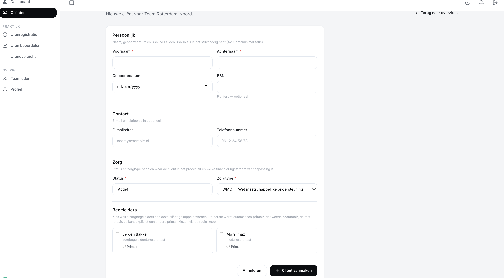

# US-07 — Cliënt aanmaken met persoonsgegevens — Uitwerking

> **User story:** Als teamleider wil ik een nieuwe cliënt kunnen aanmaken met persoonsgegevens (voornaam, achternaam, e-mail, telefoon, BSN, geboortedatum), status en zorgtype, zodat de cliënt opgenomen wordt in het systeem en gekoppeld kan worden aan begeleiders.

Gerelateerd: [testplan](../../testplan/US07-client-aanmaken.md) · [user stories](../../user-stories.md)

---

## Functionaliteit

- `/clients/create` — alleen teamleider (policy `create`)
- Verplichte velden: voornaam, achternaam, status, zorgtype (`care_type`)
- Optionele velden: e-mail, telefoon, BSN, geboortedatum
- **BSN-validatie**: exact 9 cijfers (`regex:/^\d{9}$/`) + uniek in `clients`
- **Geboortedatum**: moet vóór vandaag liggen (`before:today`)
- **Status**: `actief` / `wachtlijst` / `inactief` (`Rule::in`-whitelist)
- **Zorgtype**: WMO / WLZ / Jeugdwet (`Rule::in`-whitelist)
- `team_id` en `created_by_user_id` worden server-side gezet (geen mass-assignment)
- Bij create kunnen meteen begeleiders gekoppeld worden via `syncCaregivers()` (US-08)
- Na succes: redirect naar `/clients/{id}` (show-pagina) met flash "Cliënt aangemaakt."

---

## Screenshots functionaliteit



*/clients/create formulier met persoonsgegevens*

---

## Code uitwerking

### Route — [`routes/web.php`](../../../routes/web.php)

```php
Route::get('/clients/create', [ClientController::class, 'create'])->name('clients.create');
Route::post('/clients', [ClientController::class, 'store'])->name('clients.store');
```

### Controller — [`app/Http/Controllers/ClientController.php`](../../../app/Http/Controllers/ClientController.php)

```php
public function create(): View
{
    $this->authorize('create', Client::class);

    return view('clients.create', [
        'availableCaregivers' => $this->availableCaregivers(),
    ]);
}

public function store(StoreClientRequest $request, CaregiverAssignmentRequest $caregiverRequest): RedirectResponse
{
    $client = $this->clients->create($request->validatedPayload());

    $payload = $caregiverRequest->validatedPayload();
    $this->clients->syncCaregivers(
        client: $client,
        userIds: $payload['userIds'],
        primaryId: $payload['primaryId'],
        changedBy: $request->user(),
    );

    return redirect()
        ->route('clients.show', $client)
        ->with('success', 'Cliënt aangemaakt.');
}
```

### Validatie — [`app/Http/Requests/Clients/StoreClientRequest.php`](../../../app/Http/Requests/Clients/StoreClientRequest.php)

```php
public function rules(): array
{
    return [
        'voornaam' => ['required', 'string', 'max:255'],
        'achternaam' => ['required', 'string', 'max:255'],
        'email' => ['nullable', 'email', 'max:255'],
        'telefoon' => ['nullable', 'string', 'max:30'],
        'bsn' => ['nullable', 'string', 'size:9', 'regex:/^\d{9}$/', 'unique:clients,bsn'],
        'geboortedatum' => ['nullable', 'date', 'before:today'],
        'status' => ['required', Rule::in([
            Client::STATUS_ACTIEF,
            Client::STATUS_WACHT,
            Client::STATUS_INACTIEF,
        ])],
        'care_type' => ['required', Rule::in([
            Client::CARE_WMO,
            Client::CARE_WLZ,
            Client::CARE_JW,
        ])],
    ];
}

public function validatedPayload(): array
{
    $data = $this->validated();

    return [
        'voornaam' => $data['voornaam'],
        'achternaam' => $data['achternaam'],
        'email' => $data['email'] ?? null,
        'telefoon' => $data['telefoon'] ?? null,
        'bsn' => $data['bsn'] ?? null,
        'geboortedatum' => $data['geboortedatum'] ?? null,
        'status' => $data['status'],
        'care_type' => $data['care_type'],
        'team_id' => $this->user()->team_id,
        'created_by_user_id' => $this->user()->id,
    ];
}
```

### Policy — [`app/Policies/ClientPolicy.php`](../../../app/Policies/ClientPolicy.php)

```php
public function create(User $user): bool
{
    return $user->is_active && $user->isTeamleider();
}
```

### View — [`resources/views/clients/create.blade.php`](../../../resources/views/clients/create.blade.php)

Blade-formulier met alle velden, CSRF-token, server-side foutmeldingen via `@error('veld')` en `old()` voor re-fill. Includeert ook caregiver-selectie (US-08).

---

## Testgebruikers (seeders)

| E-mail | Wachtwoord | Rol |
|---|---|---|
| `abdisamadvanabdulle@gmail.com` | `password` | teamleider |
| `zorgbegeleider@nexora.test` | `password` | zorgbegeleider (voor 403-test) |

Setup: `php artisan migrate:fresh --seed` · URL: [http://nexora.test/clients/create](http://nexora.test/clients/create)

### Test-data voor nieuwe cliënt

| Veld | Waarde |
|---|---|
| Voornaam | Anna |
| Achternaam | De Vries |
| E-mail | `anna@voorbeeld.nl` |
| Telefoon | `0612345678` |
| BSN | `123456782` |
| Geboortedatum | `1985-04-12` |
| Status | Actief |
| Zorgtype | WMO |
