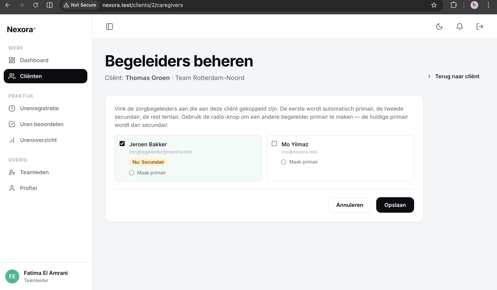

# US-08 — Cliënten koppelen aan begeleiders (primair / secundair / tertiair) — Uitwerking

> **User story:** Als teamleider wil ik een cliënt kunnen koppelen aan één of meerdere zorgbegeleiders met een rolverdeling (primair, secundair, tertiair), zodat duidelijk is wie verantwoordelijk is voor welke cliënt — en zorgbegeleiders krijgen automatisch een notificatie bij nieuwe koppeling.

Gerelateerd: [testplan](../../testplan/US08-caregivers-koppeling.md) · [user stories](../../user-stories.md)

---

## Functionaliteit

- Pivot-tabel `client_caregivers` met kolommen: `client_id`, `user_id`, `role`, `created_by_user_id`
- Rollen: `primair`, `secundair`, `tertiair` — automatisch toegewezen op basis van volgorde
- **Partial unique index**: max. 1 primair en 1 secundair per cliënt (tertiair onbeperkt)
- `computeCaregiverRoles()` bepaalt rol op basis van: explicit primary → eerste positie, daarna volgorde
- `syncCaregivers()` werkt via delete-insert-pattern (transactioneel):
  1. **Remove**: bestaande koppelingen die niet meer aangevinkt zijn
  2. **Stage**: blijvende koppelingen tijdelijk naar `tertiair` (voorkomt unique-index botsing bij rol-swap)
  3. **Upsert**: definitieve rollen toekennen
  4. **Notify**: alleen nieuwe koppelingen krijgen een notification (geen spam bij rol-wissel)
- Validatie: alleen actieve zorgbegeleiders uit eigen team kunnen worden gekoppeld
- Cross-field check: `primary_user_id` moet ook in `caregiver_ids` zitten

---

## Screenshots functionaliteit



*Begeleider-selectie met primair/secundair/tertiair*

---

## Code uitwerking

### Validatie — [`app/Http/Requests/Clients/CaregiverAssignmentRequest.php`](../../../app/Http/Requests/Clients/CaregiverAssignmentRequest.php)

```php
public function rules(): array
{
    return [
        'caregiver_ids' => ['sometimes', 'array'],
        'caregiver_ids.*' => ['integer', 'exists:users,id'],
        'primary_user_id' => ['nullable', 'integer'],
    ];
}

public function withValidator(Validator $validator): void
{
    $validator->after(function (Validator $v) {
        $ids = array_values(array_unique(array_map('intval', $this->input('caregiver_ids', []) ?? [])));
        $primaryId = $this->input('primary_user_id');

        if ($primaryId !== null && $primaryId !== '' && !in_array((int) $primaryId, $ids, true)) {
            $v->errors()->add('primary_user_id', 'De primaire begeleider moet ook aangevinkt zijn.');
        }

        if ($ids === []) {
            return;
        }

        $validUsers = User::query()
            ->whereIn('id', $ids)
            ->where('team_id', $this->user()->team_id)
            ->where('role', User::ROLE_ZORGBEGELEIDER)
            ->where('is_active', true)
            ->pluck('id')
            ->all();

        $invalid = array_diff($ids, $validUsers);
        if ($invalid !== []) {
            $v->errors()->add(
                'caregiver_ids',
                'Alleen actieve zorgbegeleiders uit je eigen team kunnen gekoppeld worden.'
            );
        }
    });
}
```

### Rol-berekening — [`app/Services/ClientService.php`](../../../app/Services/ClientService.php)

```php
public function computeCaregiverRoles(array $userIds, ?int $explicitPrimaryId = null): array
{
    $unique = array_values(array_unique(array_map('intval', $userIds)));

    if ($unique === []) {
        return [];
    }

    // Promote explicit primary to first position if present.
    if ($explicitPrimaryId !== null && in_array($explicitPrimaryId, $unique, true)) {
        $unique = array_values(array_filter($unique, fn ($id) => $id !== $explicitPrimaryId));
        array_unshift($unique, $explicitPrimaryId);
    }

    $roles = [];
    foreach ($unique as $i => $id) {
        $roles[$id] = match ($i) {
            0 => Client::ROLE_PRIMAIR,
            1 => Client::ROLE_SECUNDAIR,
            default => Client::ROLE_TERTIAIR,
        };
    }

    return $roles;
}
```

### Sync-service met staging — [`app/Services/ClientService.php`](../../../app/Services/ClientService.php)

```php
public function syncCaregivers(Client $client, array $userIds, ?int $primaryId, User $changedBy): void
{
    DB::transaction(function () use ($client, $userIds, $primaryId, $changedBy) {
        $roles = $this->computeCaregiverRoles($userIds, $primaryId);

        $currentIds = $client->caregivers()->pluck('users.id')->all();
        $newIds = array_keys($roles);

        // 1. Remove
        $toRemove = array_diff($currentIds, $newIds);
        if ($toRemove !== []) {
            $client->caregivers()->detach($toRemove);
        }

        // 2. Stage: blijvende koppelingen tijdelijk naar 'tertiair'
        //    Voorkomt unique-index botsing bij rol-swap (A: primair→secundair, B: secundair→primair).
        $commonIds = array_intersect($currentIds, $newIds);
        if ($commonIds !== []) {
            DB::table('client_caregivers')
                ->where('client_id', $client->id)
                ->whereIn('user_id', $commonIds)
                ->update(['role' => Client::ROLE_TERTIAIR, 'updated_at' => now()]);
        }

        // 3. Upsert finale rollen
        $nieuwGekoppeld = [];
        foreach ($newIds as $userId) {
            $role = $roles[$userId];

            if (in_array($userId, $currentIds, true)) {
                $client->caregivers()->updateExistingPivot($userId, [
                    'role' => $role,
                    'updated_at' => now(),
                ]);
            } else {
                $client->caregivers()->attach($userId, [
                    'role' => $role,
                    'created_by_user_id' => $changedBy->id,
                ]);
                $nieuwGekoppeld[] = ['user_id' => $userId, 'role' => $role];
            }
        }

        // 4. Notifications voor nieuwe koppelingen (AC-4)
        foreach ($nieuwGekoppeld as $entry) {
            $user = User::find($entry['user_id']);
            if ($user) {
                $user->notify(new ClientToegewezenNotification($client, $entry['role']));
            }
        }
    });
}
```

### Migratie — partial unique indexes — `database/migrations/*_client_caregivers_table.php`

```php
Schema::create('client_caregivers', function (Blueprint $table) {
    $table->id();
    $table->foreignId('client_id')->constrained()->cascadeOnDelete();
    $table->foreignId('user_id')->constrained('users')->cascadeOnDelete();
    $table->string('role'); // primair / secundair / tertiair
    $table->foreignId('created_by_user_id')->constrained('users');
    $table->timestamps();
});

// Partial unique index: max. 1 primair per client
DB::statement('CREATE UNIQUE INDEX client_caregivers_one_primary
    ON client_caregivers (client_id) WHERE role = \'primair\'');

// Partial unique index: max. 1 secundair per client
DB::statement('CREATE UNIQUE INDEX client_caregivers_one_secundair
    ON client_caregivers (client_id) WHERE role = \'secundair\'');
```

---

## Testgebruikers (seeders)

| E-mail | Wachtwoord | Rol | Team |
|---|---|---|---|
| `abdisamadvanabdulle@gmail.com` | `password` | teamleider | Rotterdam-Noord |
| `zorgbegeleider@nexora.test` | `password` | zorgbegeleider | Rotterdam-Noord |
| `mo@nexora.test` | `password` | zorgbegeleider | Rotterdam-Noord |
| `noa@nexora.test` | `password` | zorgbegeleider | Amsterdam-Zuid (voor cross-team test) |

Setup: `php artisan migrate:fresh --seed` · URL: [http://nexora.test/clients/create](http://nexora.test/clients/create)
