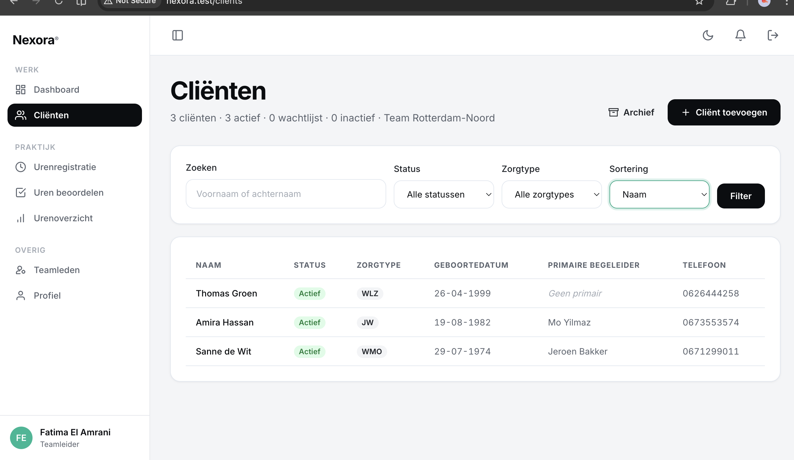

# US-09 — Cliënten overzicht met zoek en filter — Uitwerking

> **User story:** Als zorgbegeleider of teamleider wil ik een overzicht van cliënten zien (gescoped op rol), met zoek op naam, filter op status/zorgtype en sortering, zodat ik snel de juiste cliënt terugvind.

Gerelateerd: [testplan](../../testplan/US09-clienten-overzicht.md) · [user stories](../../user-stories.md)

---

## Functionaliteit

- `/clients` — beschikbaar voor zowel teamleider als zorgbegeleider (verschillende scope)
- **Teamleider** ziet alle cliënten van eigen `team_id`
- **Zorgbegeleider** ziet alleen cliënten waaraan hij via `client_caregivers` gekoppeld is
- Zoek op voornaam **of** achternaam (case-insensitive LIKE)
- Filter op status (`actief` / `wachtlijst` / `inactief`) via whitelist
- Filter op zorgtype (`WMO` / `WLZ` / `JW`) via whitelist
- Sortering: `name` (achternaam-voornaam) / `status` / `created_at`
- Eager loading van `caregivers` + `team` — voorkomt N+1
- 15 cliënten per pagina (`paginate->withQueryString`)
- Header-tellers per status zichtbaar (rol-gebaseerd)

---

## Screenshots functionaliteit



*/clients overzicht met filters en zoekveld*

---

## Code uitwerking

### Route — [`routes/web.php`](../../../routes/web.php)

```php
Route::get('/clients', [ClientController::class, 'index'])->name('clients.index');
```

### Controller — [`app/Http/Controllers/ClientController.php`](../../../app/Http/Controllers/ClientController.php)

```php
public function index(Request $request): View
{
    $this->authorize('viewAny', Client::class);

    $user = auth()->user();

    $filters = [
        'search' => trim((string) $request->query('search', '')),
        'status' => $request->query('status'),
        'care_type' => $request->query('care_type'),
        'sort' => $request->query('sort', 'name'),
    ];

    $clients = $this->clients->getPaginated($user, $filters);

    $scope = $this->clients->scopedForUser($user);
    $totals = [
        'totaal' => (clone $scope)->count(),
        'actief' => (clone $scope)->where('status', Client::STATUS_ACTIEF)->count(),
        'wacht' => (clone $scope)->where('status', Client::STATUS_WACHT)->count(),
        'inactief' => (clone $scope)->where('status', Client::STATUS_INACTIEF)->count(),
    ];

    return view('clients.index', compact('clients', 'filters', 'totals'));
}
```

### Rol-gebaseerde scope — [`app/Services/ClientService.php`](../../../app/Services/ClientService.php)

```php
public function scopedForUser(User $user): Builder
{
    if (!$user->is_active) {
        return Client::query()->whereRaw('1 = 0');
    }

    if ($user->isTeamleider()) {
        return Client::query()->where('team_id', $user->team_id);
    }

    if ($user->isZorgbegeleider()) {
        return Client::query()->whereHas(
            'caregivers',
            fn (Builder $q) => $q->where('users.id', $user->id)
        );
    }

    return Client::query()->whereRaw('1 = 0');
}
```

### Filter + sortering + paginatie — [`app/Services/ClientService.php`](../../../app/Services/ClientService.php)

```php
public function getPaginated(User $user, array $filters = [], int $perPage = 15): LengthAwarePaginator
{
    $query = $this->scopedForUser($user)
        ->with(['caregivers', 'team']);

    $search = trim((string) ($filters['search'] ?? ''));
    if ($search !== '') {
        $query->where(function (Builder $q) use ($search) {
            $q->where('voornaam', 'like', "%{$search}%")
                ->orWhere('achternaam', 'like', "%{$search}%");
        });
    }

    $status = $filters['status'] ?? null;
    if (in_array($status, [Client::STATUS_ACTIEF, Client::STATUS_WACHT, Client::STATUS_INACTIEF], true)) {
        $query->where('status', $status);
    }

    $careType = $filters['care_type'] ?? null;
    if (in_array($careType, [Client::CARE_WMO, Client::CARE_WLZ, Client::CARE_JW], true)) {
        $query->where('care_type', $careType);
    }

    // Sortering via whitelist (geen arbitrary column-name via user-input).
    $sort = $filters['sort'] ?? 'name';
    match ($sort) {
        'status' => $query->orderBy('status')->orderBy('achternaam')->orderBy('voornaam'),
        'created_at' => $query->orderByDesc('created_at'),
        default => $query->orderBy('achternaam')->orderBy('voornaam'),
    };

    return $query->paginate($perPage)->withQueryString();
}
```

### Policy — [`app/Policies/ClientPolicy.php`](../../../app/Policies/ClientPolicy.php)

```php
public function viewAny(User $user): bool
{
    return $user->is_active;
}
```

---

## Testgebruikers (seeders)

| E-mail | Wachtwoord | Rol | Toegang |
|---|---|---|---|
| `claudeabdi+tl@gmail.com` | `password` | teamleider | alle cliënten van team |
| `zorgbegeleider@nexora.test` | `password` | zorgbegeleider | alleen eigen koppelingen |
| `mo@nexora.test` | `password` | zorgbegeleider | andere caseload (voor scope-test) |

Setup: `php artisan migrate:fresh --seed` · URL: [http://nexora.test/clients](http://nexora.test/clients)
