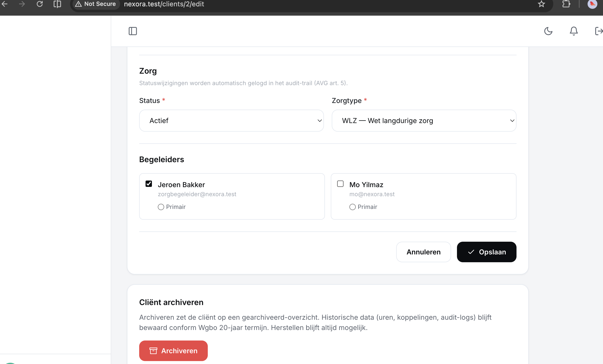

# US-10 — Cliënt bewerken en archiveren — Uitwerking

> **User story:** Als teamleider wil ik cliëntgegevens kunnen bewerken (inclusief statuswijziging met log) en cliënten kunnen archiveren (soft delete) of herstellen, zodat het overzicht actueel blijft maar dossiers nooit verloren gaan — conform Wgbo-bewaarplicht.

Gerelateerd: [testplan](../../testplan/US10-client-bewerken-archiveren.md) · [user stories](../../user-stories.md)

---

## Functionaliteit

- `/clients/{client}/edit` — bewerken van persoonsgegevens, status, zorgtype, caregivers
- `UpdateClientRequest` valideert (inclusief `Rule::unique('bsn')->ignore($client->id)`)
- **Status-changelog**: bij iedere statuswijziging een rij in `client_status_logs`
- Diff-check voorkomt lege audit-rij bij save-zonder-status-change
- DELETE `/clients/{client}` → soft delete (`deleted_at`-timestamp)
- Pivot-koppelingen blijven bestaan na archiveren
- `/clients/archive` — overzicht van gearchiveerde cliënten (alleen teamleider)
- POST `/clients/{client}/restore` — herstelt cliënt naar actief overzicht
- `forceDelete()` blijft geblokkeerd in policy — geen permanent delete via UI (Wgbo)

---

## Screenshots functionaliteit



*Cliënt bewerken met statuslog en archiveer-knop*

---

## Code uitwerking

### Routes — [`routes/web.php`](../../../routes/web.php)

```php
Route::get('/clients/archive', [ClientController::class, 'archiveIndex'])
    ->middleware('teamleider')
    ->name('clients.archive.index');

Route::get('/clients/{client}/edit', [ClientController::class, 'edit'])
    ->whereNumber('client')
    ->name('clients.edit');
Route::put('/clients/{client}', [ClientController::class, 'update'])
    ->whereNumber('client')
    ->name('clients.update');
Route::delete('/clients/{client}', [ClientController::class, 'archive'])
    ->whereNumber('client')
    ->name('clients.archive');
Route::post('/clients/{client}/restore', [ClientController::class, 'restore'])
    ->whereNumber('client')
    ->name('clients.restore');
```

### Controller — [`app/Http/Controllers/ClientController.php`](../../../app/Http/Controllers/ClientController.php)

```php
public function edit(Client $client): View
{
    $this->authorize('update', $client);

    $client->load('caregivers');

    return view('clients.edit', [
        'client' => $client,
        'availableCaregivers' => $this->availableCaregivers(),
    ]);
}

public function update(
    UpdateClientRequest $request,
    CaregiverAssignmentRequest $caregiverRequest,
    Client $client
): RedirectResponse {
    $this->clients->update(
        client: $client,
        payload: $request->validatedPayload(),
        changedBy: $request->user(),
    );

    $caregiverPayload = $caregiverRequest->validatedPayload();
    $this->clients->syncCaregivers(
        client: $client,
        userIds: $caregiverPayload['userIds'],
        primaryId: $caregiverPayload['primaryId'],
        changedBy: $request->user(),
    );

    return redirect()
        ->route('clients.show', $client)
        ->with('success', 'Cliënt bijgewerkt.');
}

public function archive(Request $request, Client $client): RedirectResponse
{
    $this->authorize('delete', $client);

    $this->clients->archive($client, $request->user());

    return redirect()
        ->route('clients.index')
        ->with('success', 'Cliënt gearchiveerd.');
}

public function archiveIndex(): View
{
    $this->authorize('viewAny', Client::class);

    $clients = Client::onlyTrashed()
        ->where('team_id', auth()->user()->team_id)
        ->with(['team'])
        ->orderByDesc('deleted_at')
        ->paginate(15);

    return view('clients.archive', ['clients' => $clients]);
}

public function restore(Request $request, int $client): RedirectResponse
{
    $model = Client::withTrashed()->findOrFail($client);

    $this->authorize('restore', $model);

    $this->clients->restore($model, $request->user());

    return redirect()
        ->route('clients.show', $model)
        ->with('success', 'Cliënt hersteld.');
}
```

### Service met statuslog — [`app/Services/ClientService.php`](../../../app/Services/ClientService.php)

```php
public function update(Client $client, array $payload, User $changedBy): void
{
    DB::transaction(function () use ($client, $payload, $changedBy) {
        $oldStatus = $client->status;
        $client->update($payload);

        if ($oldStatus !== $payload['status']) {
            ClientStatusLog::create([
                'client_id' => $client->id,
                'changed_by_user_id' => $changedBy->id,
                'old_status' => $oldStatus,
                'new_status' => $payload['status'],
            ]);
        }
    });
}

public function archive(Client $client, User $by): void
{
    DB::transaction(fn () => $client->delete()); // soft delete
}

public function restore(Client $client, User $by): void
{
    DB::transaction(fn () => $client->restore());
}
```

### Policy — [`app/Policies/ClientPolicy.php`](../../../app/Policies/ClientPolicy.php)

```php
public function delete(User $user, Client $client): bool
{
    return $user->is_active
        && $user->isTeamleider()
        && $user->team_id === $client->team_id;
}

public function restore(User $user, Client $client): bool
{
    return $this->delete($user, $client);
}

public function forceDelete(User $user, Client $client): bool
{
    // Permanent verwijderen is altijd geblokkeerd — Wgbo 20-jaar bewaarplicht
    return false;
}
```

---

## Testgebruikers (seeders)

| E-mail | Wachtwoord | Rol |
|---|---|---|
| `claudeabdi+tl@gmail.com` | `password` | teamleider |
| `zorgbegeleider@nexora.test` | `password` | zorgbegeleider (voor 403-test op archive/restore) |

Setup: `php artisan migrate:fresh --seed` · URL: [http://nexora.test/clients](http://nexora.test/clients)
