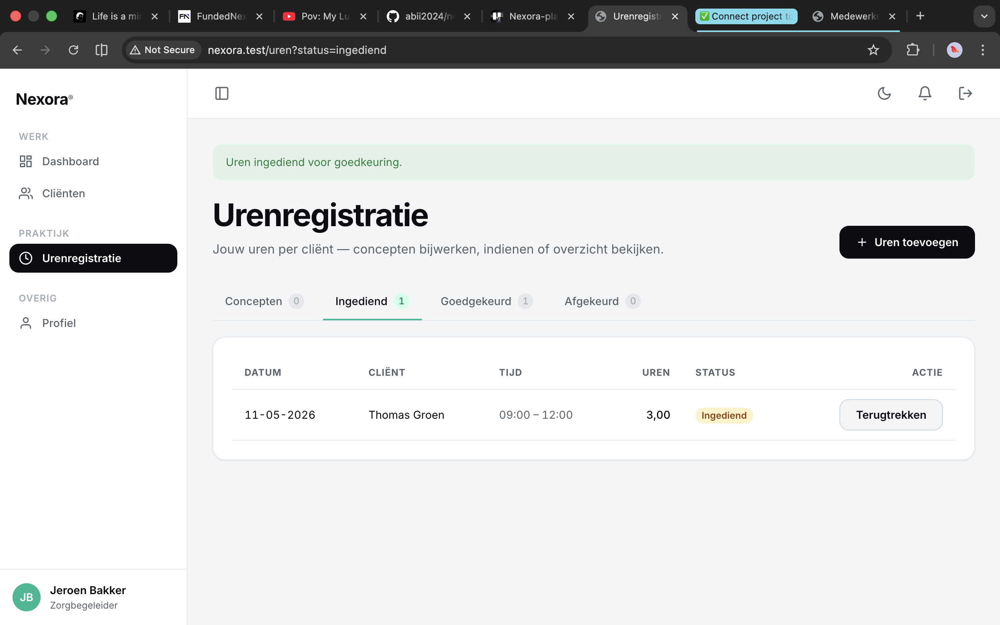

# US-12 — Uren indienen, terugtrekken, opnieuw indienen — Uitwerking

> **User story:** Als zorgbegeleider wil ik concept-uren kunnen indienen voor goedkeuring, en — zolang ze nog niet beoordeeld zijn — kunnen terugtrekken om te corrigeren. Afgekeurde uren kan ik corrigeren en opnieuw indienen. Bij elke indiening krijgen mijn teamleiders een notificatie.

Gerelateerd: [testplan](../../testplan/US12-uren-indienen.md) · [user stories](../../user-stories.md)

---

## Functionaliteit

- **Status state-machine** in `UrenregistratieService::transition()` — alle status-mutaties lopen hier door
- Allowed-matrix:
  - `Concept → Ingediend` (submit)
  - `Ingediend → Concept` (withdraw)
  - `Ingediend → Goedgekeurd / Afgekeurd` (teamleider, US-13)
  - `Afgekeurd → Ingediend` (resubmit, na correctie)
  - `Goedgekeurd → (terminal)` — geen verdere transitie
- Niet-toegestane transitie → `InvalidStateTransitionException`
- Bij indienen: extra check `isIndienbaar()` — cliënt, uren>0 en beide tijden ingevuld
- Bij `Afgekeurd → Ingediend`: `afkeur_reden` wordt gewist
- **Notification**: bij elke indiening krijgen alle actieve teamleiders van het team een `UrenIngediendNotification`
- Policy-methods `submit` / `withdraw` / `resubmit` checken status én eigenaarschap

---

## Screenshots functionaliteit



*Concept-uren met indien/terugtrek-knoppen*

---

## Code uitwerking

### Routes — [`routes/web.php`](../../../routes/web.php)

```php
Route::middleware('zorgbegeleider')->group(function () {
    Route::post('/uren/{uren}/submit', [UrenregistratieController::class, 'submit'])->name('uren.submit');
    Route::post('/uren/{uren}/withdraw', [UrenregistratieController::class, 'withdraw'])->name('uren.withdraw');
    Route::put('/uren/{uren}/resubmit', [UrenregistratieController::class, 'resubmit'])->name('uren.resubmit');
});
```

### Controller — [`app/Http/Controllers/UrenregistratieController.php`](../../../app/Http/Controllers/UrenregistratieController.php)

```php
public function submit(Request $request, Urenregistratie $uren): RedirectResponse
{
    $this->authorize('submit', $uren);

    $this->uren->submit($uren, $request->user());

    return redirect()
        ->route('uren.index', ['status' => UrenStatus::Ingediend->value])
        ->with('success', 'Uren ingediend voor goedkeuring.');
}

public function withdraw(Request $request, Urenregistratie $uren): RedirectResponse
{
    $this->authorize('withdraw', $uren);

    $this->uren->withdraw($uren, $request->user());

    return redirect()
        ->route('uren.index', ['status' => UrenStatus::Concept->value])
        ->with('success', 'Uren teruggetrokken — nu weer bewerkbaar als concept.');
}

public function resubmit(UpdateUrenregistratieRequest $request, Urenregistratie $uren): RedirectResponse
{
    $this->authorize('resubmit', $uren);

    $payload = $request->validatedPayload();

    if (!$this->ownCaregiverClients()->contains('id', $payload['client_id'])) {
        abort(403, 'Deze cliënt hoort niet bij jouw caseload.');
    }

    $this->uren->update($uren, $payload);
    $this->uren->resubmit($uren, $request->user());

    return redirect()
        ->route('uren.index', ['status' => UrenStatus::Ingediend->value])
        ->with('success', 'Uren opnieuw ingediend.');
}
```

### Centrale state-machine — [`app/Services/UrenregistratieService.php`](../../../app/Services/UrenregistratieService.php)

```php
public function transition(Urenregistratie $uren, UrenStatus $to, User $actor): void
{
    $from = $uren->status;

    $allowed = match ($from) {
        UrenStatus::Concept => [UrenStatus::Ingediend],
        UrenStatus::Ingediend => [UrenStatus::Concept, UrenStatus::Goedgekeurd, UrenStatus::Afgekeurd],
        UrenStatus::Afgekeurd => [UrenStatus::Ingediend],
        UrenStatus::Goedgekeurd => [],
    };

    if (!in_array($to, $allowed, true)) {
        throw new InvalidStateTransitionException($from, $to);
    }

    // Extra: indienen vereist dat de entry volledig is.
    if ($to === UrenStatus::Ingediend && !$uren->isIndienbaar()) {
        throw new InvalidStateTransitionException(
            $from, $to,
            'Entry is niet geldig om in te dienen (cliënt, uren of tijden ontbreken).'
        );
    }

    DB::transaction(function () use ($uren, $to, $actor) {
        // AC-4: bij opnieuw-indienen afkeur_reden wissen.
        if ($uren->status === UrenStatus::Afgekeurd && $to === UrenStatus::Ingediend) {
            $uren->afkeur_reden = null;
        }

        $uren->status = $to;
        $uren->save();

        // AC-2: bij indienen alle teamleiders notificeren.
        if ($to === UrenStatus::Ingediend) {
            $teamleiders = User::query()
                ->where('role', User::ROLE_TEAMLEIDER)
                ->where('team_id', $actor->team_id)
                ->where('is_active', true)
                ->get();

            if ($teamleiders->isNotEmpty()) {
                Notification::send(
                    $teamleiders,
                    new UrenIngediendNotification($uren, $actor)
                );
            }
        }
    });
}

public function submit(Urenregistratie $uren, User $actor): void
{
    $this->transition($uren, UrenStatus::Ingediend, $actor);
}

public function withdraw(Urenregistratie $uren, User $actor): void
{
    $this->transition($uren, UrenStatus::Concept, $actor);
}

public function resubmit(Urenregistratie $uren, User $actor): void
{
    $this->transition($uren, UrenStatus::Ingediend, $actor);
}
```

### Policy — [`app/Policies/UrenregistratiePolicy.php`](../../../app/Policies/UrenregistratiePolicy.php)

```php
public function submit(User $user, Urenregistratie $uren): bool
{
    return $user->is_active
        && $user->id === $uren->user_id
        && $uren->status === UrenStatus::Concept;
}

public function withdraw(User $user, Urenregistratie $uren): bool
{
    return $user->is_active
        && $user->id === $uren->user_id
        && $uren->status === UrenStatus::Ingediend;
}

public function resubmit(User $user, Urenregistratie $uren): bool
{
    return $user->is_active
        && $user->id === $uren->user_id
        && $uren->status === UrenStatus::Afgekeurd;
}
```

---

## Testgebruikers (seeders)

| E-mail | Wachtwoord | Rol |
|---|---|---|
| `zorgbegeleider@nexora.test` | `password` | zorgbegeleider |
| `abdisamadvanabdulle@gmail.com` | `password` | teamleider (ontvanger van notificatie) |

Setup: `php artisan migrate:fresh --seed` · URL: [http://nexora.test/uren](http://nexora.test/uren)
