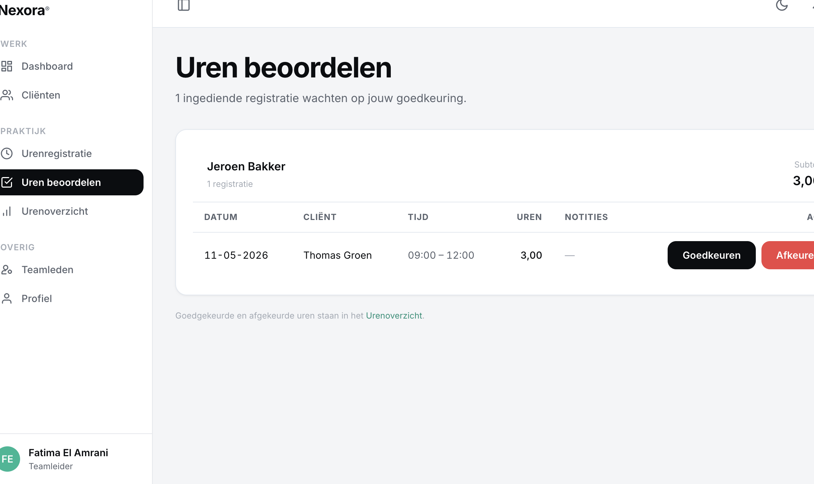

# US-13 — Uren beoordelen (goedkeuren / afkeuren) — Uitwerking

> **User story:** Als teamleider wil ik ingediende uren van mijn team kunnen goedkeuren of afkeuren met een verplichte reden, zodat correcte uren in de administratie komen en mijn medewerkers feedback krijgen bij fouten.

Gerelateerd: [testplan](../../testplan/US13-uren-beoordelen.md) · [user stories](../../user-stories.md)

---

## Functionaliteit

- `/teamleider/uren` — alle ingediende uren gegroepeerd per medewerker
- `scopedForTeamleider()` filtert op `team_id` en `status=Ingediend`
- Goedkeuren: directe knop, geen modal — POST `/teamleider/uren/{uren}/goedkeuren`
- Afkeuren: form met verplichte `teamleider_notitie` (min. 10 tekens) — POST `/teamleider/uren/{uren}/afkeuren`
- Bij goedkeuring:
  - Status `Ingediend → Goedgekeurd` (terminal)
  - `goedgekeurd_door_user_id` + `beoordeeld_op` opgeslagen
  - `UrenGoedgekeurdNotification` naar zorgbegeleider
- Bij afkeuring:
  - Status `Ingediend → Afgekeurd`
  - `afkeur_reden` opgeslagen (zorgbegeleider ziet dit in edit-banner)
  - `UrenAfgekeurdNotification` met reden naar zorgbegeleider
- State-machine in service blokkeert verkeerde transitions (bv. Goedgekeurd → ...)

---

## Screenshots functionaliteit



*/teamleider/uren gegroepeerd per medewerker met goedkeur/afkeur-acties*

---

## Code uitwerking

### Routes — [`routes/web.php`](../../../routes/web.php)

```php
Route::middleware('teamleider')->prefix('teamleider')->name('teamleider.')->group(function () {
    Route::get('/uren', [TeamleiderUrenController::class, 'index'])->name('uren.index');
    Route::post('/uren/{uren}/goedkeuren', [TeamleiderUrenController::class, 'approve'])->name('uren.approve');
    Route::post('/uren/{uren}/afkeuren', [TeamleiderUrenController::class, 'reject'])->name('uren.reject');
});
```

### Controller — [`app/Http/Controllers/TeamleiderUrenController.php`](../../../app/Http/Controllers/TeamleiderUrenController.php)

```php
public function index(Request $request): View
{
    $this->authorize('viewAny', Urenregistratie::class);

    $rows = $this->uren
        ->scopedForTeamleider($request->user(), UrenStatus::Ingediend)
        ->get();

    $byUser = $rows->groupBy('user_id');

    return view('teamleider.uren.index', [
        'groups' => $byUser,
        'totalRows' => $rows->count(),
    ]);
}

public function approve(Request $request, Urenregistratie $uren): RedirectResponse
{
    $this->authorize('goedkeuren', $uren);

    $this->uren->approve($uren, $request->user());

    return redirect()
        ->route('teamleider.uren.index')
        ->with('success', 'Uren goedgekeurd.');
}

public function reject(AfkeurUrenRequest $request, Urenregistratie $uren): RedirectResponse
{
    $reden = $request->validatedPayload();

    $this->uren->reject($uren, $request->user(), $reden);

    return redirect()
        ->route('teamleider.uren.index')
        ->with('success', 'Uren afgekeurd — reden verzonden naar medewerker.');
}
```

### Validatie afkeuren — [`app/Http/Requests/Uren/AfkeurUrenRequest.php`](../../../app/Http/Requests/Uren/AfkeurUrenRequest.php)

```php
public function authorize(): bool
{
    $uren = $this->route('uren');

    return $uren instanceof Urenregistratie
        && ($this->user()?->can('afkeuren', $uren) ?? false);
}

public function rules(): array
{
    return [
        'teamleider_notitie' => ['required', 'string', 'min:10', 'max:2000'],
    ];
}

public function messages(): array
{
    return [
        'teamleider_notitie.required' => 'Geef een reden van afwijzing.',
        'teamleider_notitie.min' => 'De reden moet minstens 10 tekens bevatten.',
    ];
}

public function validatedPayload(): string
{
    return trim($this->validated()['teamleider_notitie']);
}
```

### Service approve + reject — [`app/Services/UrenregistratieService.php`](../../../app/Services/UrenregistratieService.php)

```php
public function approve(Urenregistratie $uren, User $teamleider): void
{
    DB::transaction(function () use ($uren, $teamleider) {
        $this->transition($uren, UrenStatus::Goedgekeurd, $teamleider);

        $uren->forceFill([
            'goedgekeurd_door_user_id' => $teamleider->id,
            'beoordeeld_op' => now(),
        ])->save();

        if ($uren->user) {
            Notification::send(
                $uren->user,
                new UrenGoedgekeurdNotification($uren, $teamleider)
            );
        }
    });
}

public function reject(Urenregistratie $uren, User $teamleider, string $reden): void
{
    DB::transaction(function () use ($uren, $teamleider, $reden) {
        $this->transition($uren, UrenStatus::Afgekeurd, $teamleider);

        $uren->forceFill([
            'afkeur_reden' => $reden,
            'goedgekeurd_door_user_id' => $teamleider->id,
            'beoordeeld_op' => now(),
        ])->save();

        if ($uren->user) {
            Notification::send(
                $uren->user,
                new UrenAfgekeurdNotification($uren, $teamleider, $reden)
            );
        }
    });
}
```

### Policy — [`app/Policies/UrenregistratiePolicy.php`](../../../app/Policies/UrenregistratiePolicy.php)

```php
public function goedkeuren(User $user, Urenregistratie $uren): bool
{
    return $user->is_active
        && $user->isTeamleider()
        && $uren->user
        && $user->team_id === $uren->user->team_id
        && $uren->status === UrenStatus::Ingediend;
}

public function afkeuren(User $user, Urenregistratie $uren): bool
{
    return $this->goedkeuren($user, $uren);
}
```

---

## Testgebruikers (seeders)

| E-mail | Wachtwoord | Rol |
|---|---|---|
| `claudeabdi+tl@gmail.com` | `password` | teamleider |
| `zorgbegeleider@nexora.test` | `password` | zorgbegeleider (ingediende uren in seeder) |

Setup: `php artisan migrate:fresh --seed` · URL: [http://nexora.test/teamleider/uren](http://nexora.test/teamleider/uren)
