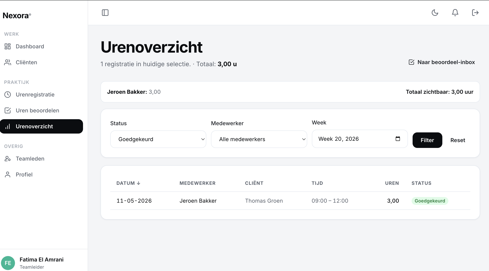

# US-14 — Urenoverzicht teamleider met filters — Uitwerking

> **User story:** Als teamleider wil ik een filterbaar overzicht van alle uren van mijn team (status, medewerker, week) met sortering, paginatie en weektotaal, zodat ik snel inzicht krijg in geleverde zorg en kan beoordelen of er fouten zijn.

Gerelateerd: [testplan](../../testplan/US14-uren-overzicht.md) · [user stories](../../user-stories.md)

---

## Functionaliteit

- `/teamleider/uren-overzicht` — alleen teamleider, scoped op eigen `team_id`
- Filters via query-string:
  - **Status**: `concept` / `ingediend` / `goedgekeurd` / `afgekeurd` / `alle`
  - **Medewerker**: `user_id` (alleen eigen team, validatie via `whereHas`)
  - **Week**: ISO 8601 `YYYY-Www` → omgezet naar `whereBetween('datum', [start, end])`
- Sortering whitelist: `datum` / `medewerker` / `duur`, richting `asc`/`desc`
- 20 rijen per pagina (`paginate->withQueryString`)
- **Weektotaal**: zichtbare rijen gegroepeerd per medewerker + grand total
- Eager loading van `client` en `user` voorkomt N+1

---

## Screenshots functionaliteit



*/teamleider/uren-overzicht met filters, sortering en weektotaal*

---

## Code uitwerking

### Route — [`routes/web.php`](../../../routes/web.php)

```php
Route::middleware('teamleider')->prefix('teamleider')->name('teamleider.')->group(function () {
    Route::get('/uren-overzicht', [TeamleiderUrenController::class, 'overzicht'])->name('uren.overzicht');
});
```

### Controller — [`app/Http/Controllers/TeamleiderUrenController.php`](../../../app/Http/Controllers/TeamleiderUrenController.php)

```php
public function overzicht(Request $request): View
{
    $this->authorize('viewAny', Urenregistratie::class);

    $user = $request->user();

    $filters = [
        'status' => $request->query('status', UrenStatus::Ingediend->value),
        'medewerker' => $request->query('medewerker', ''),
        'week' => $request->query('week', ''),
        'sort' => $request->query('sort', 'datum'),
        'direction' => $request->query('direction', 'desc'),
    ];

    $rows = $this->uren->getPaginatedForTeamleider($user, $filters);

    $medewerkers = User::query()
        ->where('team_id', $user->team_id)
        ->where('role', User::ROLE_ZORGBEGELEIDER)
        ->where('is_active', true)
        ->orderBy('name')
        ->get(['id', 'name']);

    $weekSummary = $rows
        ->getCollection()
        ->groupBy(fn ($r) => $r->user?->name ?? '—')
        ->map(fn ($group) => (float) $group->sum(fn ($r) => (float) $r->uren));

    return view('teamleider.uren.overzicht', [
        'rows' => $rows,
        'filters' => $filters,
        'medewerkers' => $medewerkers,
        'weekSummary' => $weekSummary,
        'weekTotal' => (float) $weekSummary->sum(),
    ]);
}
```

### Filter + sort + week-parser — [`app/Services/UrenregistratieService.php`](../../../app/Services/UrenregistratieService.php)

```php
public function getPaginatedForTeamleider(User $teamleider, array $filters = [], int $perPage = 20): LengthAwarePaginator
{
    $query = Urenregistratie::query()
        ->whereHas('user', fn (Builder $q) => $q->where('team_id', $teamleider->team_id))
        ->with(['client', 'user']);

    // Status-filter (whitelist).
    $status = $filters['status'] ?? UrenStatus::Ingediend->value;
    if ($status !== 'alle') {
        $statusEnum = UrenStatus::tryFrom((string) $status);
        if ($statusEnum !== null) {
            $query->where('status', $statusEnum->value);
        }
    }

    // Medewerker-filter: user_id moet in eigen team zitten.
    $medewerker = $filters['medewerker'] ?? null;
    if (is_numeric($medewerker) && (int) $medewerker > 0) {
        $query->whereHas('user', fn (Builder $q) => $q->where('id', (int) $medewerker)->where('team_id', $teamleider->team_id));
    }

    // Week-filter: ISO 8601 `YYYY-Www` → [start_of_week, end_of_week].
    $week = $filters['week'] ?? null;
    if (is_string($week) && preg_match('/^(\d{4})-W(\d{1,2})$/', $week, $m)) {
        $year = (int) $m[1];
        $weekNr = (int) $m[2];
        if ($weekNr >= 1 && $weekNr <= 53) {
            $start = now()->setISODate($year, $weekNr)->startOfWeek()->toDateString();
            $end = now()->setISODate($year, $weekNr)->endOfWeek()->toDateString();
            $query->whereBetween('datum', [$start, $end]);
        }
    }

    // Sortering (whitelist).
    $sort = $filters['sort'] ?? 'datum';
    $direction = ($filters['direction'] ?? 'desc') === 'asc' ? 'asc' : 'desc';
    match ($sort) {
        'medewerker' => $query->orderBy('user_id', $direction)->orderByDesc('datum'),
        'duur' => $query->orderBy('uren', $direction),
        default => $query->orderBy('datum', $direction)->orderByDesc('starttijd'),
    };

    return $query->paginate($perPage)->withQueryString();
}
```

---

## Testgebruikers (seeders)

| E-mail | Wachtwoord | Rol |
|---|---|---|
| `abdisamadvanabdulle@gmail.com` | `password` | teamleider |
| `zorgbegeleider@nexora.test` | `password` | zorgbegeleider (heeft uren in seeder) |
| `mo@nexora.test` | `password` | zorgbegeleider (heeft uren in seeder) |

Setup: `php artisan migrate:fresh --seed` · URL: [http://nexora.test/teamleider/uren-overzicht](http://nexora.test/teamleider/uren-overzicht)
