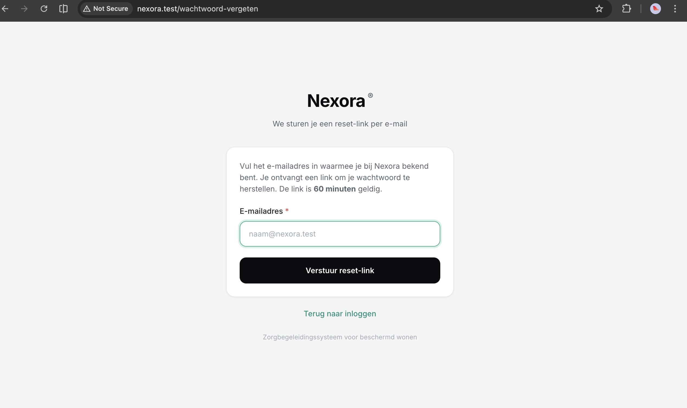
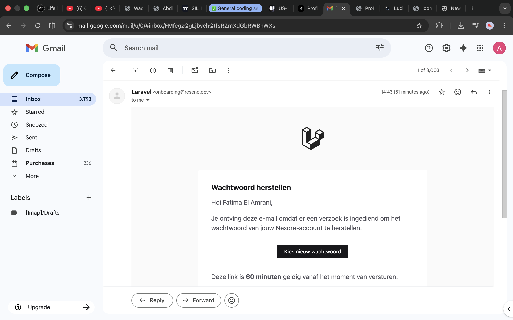

# US-15 — Wachtwoord vergeten + resetten via e-maillink — Uitwerking

> **User story:** Als gebruiker wil ik mijn wachtwoord kunnen resetten via een e-maillink wanneer ik mijn wachtwoord vergeten ben, zodat ik weer toegang krijg zonder dat de teamleider tussenkomst nodig heeft.

Gerelateerd: [testplan](../../testplan/US15-wachtwoord-reset.md) · [user stories](../../user-stories.md)

---

## Functionaliteit

- `/wachtwoord-vergeten` — formulier met e-mailveld
- `Password::sendResetLink()` retourneert altijd **dezelfde melding** ongeacht of e-mail bestaat → voorkomt **e-mail-enumeration**
- Token + email worden via e-mail verzonden (Nederlandse `WachtwoordResetNotification`)
- `/wachtwoord-reset/{token}?email=...` — reset-formulier vanaf maillink
- `Password::reset()` valideert token + lifetime + nieuwe wachtwoord
- Token-lifetime in `config/auth.php` (default 60 min)
- Nieuw wachtwoord wordt automatisch gehashed via `User::$casts['password' => 'hashed']`
- `remember_token` wordt op `null` gezet → andere sessies worden ongeldig
- **Auto-login** na succesvolle reset → redirect naar rol-specifieke dashboard
- Gebruikte/verlopen tokens geven foutmelding en blijven niet hergebruikbaar

---

## Screenshots functionaliteit



*/wachtwoord-vergeten formulier en reset-flow*



*End-to-end bewijs — de Nederlandse `WachtwoordResetNotification` daadwerkelijk in de Gmail-inbox van `abdisamadvanabdulle@gmail.com`, verstuurd via Resend (`onboarding@resend.dev`). Komt voort uit Opdracht 4 / US-17 — zie [opdracht-4-verbetervoorstellen/](../opdracht-4-verbetervoorstellen/README.md).*

---

## Code uitwerking

### Routes — [`routes/web.php`](../../../routes/web.php)

```php
Route::middleware('guest')->group(function () {
    Route::get('/wachtwoord-vergeten', [ForgotPasswordController::class, 'show'])->name('password.request');
    Route::post('/wachtwoord-vergeten', [ForgotPasswordController::class, 'store'])
        ->middleware('throttle:6,1')
        ->name('password.email');
    Route::get('/wachtwoord-reset/{token}', [ResetPasswordController::class, 'show'])->name('password.reset');
    Route::post('/wachtwoord-reset', [ResetPasswordController::class, 'store'])->name('password.update');
});
```

### Forgot — [`app/Http/Controllers/Auth/ForgotPasswordController.php`](../../../app/Http/Controllers/Auth/ForgotPasswordController.php)

```php
public function show(): View
{
    return view('auth.wachtwoord-vergeten');
}

public function store(ForgotPasswordRequest $request): RedirectResponse
{
    Password::sendResetLink($request->only('email'));

    return back()->with(
        'status',
        'Als dit adres bij een Nexora-account hoort, is er een reset-link verstuurd. Controleer ook je spam-folder.'
    );
}
```

### Reset — [`app/Http/Controllers/Auth/ResetPasswordController.php`](../../../app/Http/Controllers/Auth/ResetPasswordController.php)

```php
public function show(Request $request, string $token): View
{
    return view('auth.wachtwoord-reset', [
        'token' => $token,
        'email' => (string) $request->query('email', ''),
    ]);
}

public function store(ResetPasswordRequest $request)
{
    $status = Password::reset(
        $request->only('email', 'password', 'password_confirmation', 'token'),
        function ($user, string $password) {
            $user->forceFill([
                'password' => $password,
                'remember_token' => null,
            ])->save();

            Auth::login($user);
        }
    );

    if ($status !== Password::PasswordReset) {
        return back()
            ->withInput($request->only('email'))
            ->withErrors(['email' => __($status)]);
    }

    $user = $request->user();
    $target = $user && $user->isTeamleider()
        ? route('teamleider.dashboard')
        : route('dashboard');

    return redirect($target)->with('status', 'Je wachtwoord is bijgewerkt en je bent ingelogd.');
}
```

### Validatie — [`app/Http/Requests/Auth/ResetPasswordRequest.php`](../../../app/Http/Requests/Auth/ResetPasswordRequest.php)

```php
public function rules(): array
{
    return [
        'token' => ['required', 'string'],
        'email' => ['required', 'string', 'email'],
        'password' => ['required', 'confirmed', Password::min(8)],
    ];
}
```

### Nederlandse mail-notificatie — [`app/Models/User.php`](../../../app/Models/User.php)

```php
public function sendPasswordResetNotification($token): void
{
    $this->notify(new \App\Notifications\WachtwoordResetNotification($token));
}
```

### Notification — `app/Notifications/WachtwoordResetNotification.php`

```php
public function toMail($notifiable): MailMessage
{
    $url = url(route('password.reset', [
        'token' => $this->token,
        'email' => $notifiable->getEmailForPasswordReset(),
    ], false));

    return (new MailMessage)
        ->subject('Nexora — wachtwoord resetten')
        ->markdown('mail.wachtwoord-reset', ['url' => $url]);
}
```

---

## Testgebruikers (seeders)

| E-mail | Wachtwoord | Rol |
|---|---|---|
| `zorgbegeleider@nexora.test` | `password` | zorgbegeleider |
| `abdisamadvanabdulle@gmail.com` | `password` | teamleider |

Setup: `php artisan migrate:fresh --seed` · URL: [http://nexora.test/wachtwoord-vergeten](http://nexora.test/wachtwoord-vergeten)

### Mail inspecteren

In `.env`: `MAIL_MAILER=log` → mails verschijnen in `storage/logs/laravel.log` met de reset-URL. Of gebruik Mailtrap voor visuele inbox.
