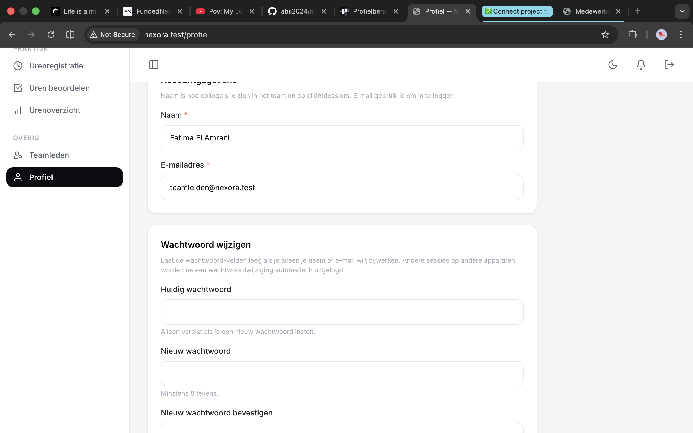

# US-16 — Profielbeheer (eigen gegevens + wachtwoord wijzigen) — Uitwerking

> **User story:** Als gebruiker wil ik mijn eigen naam, e-mailadres en wachtwoord kunnen aanpassen op een `/profiel`-pagina, zodat ik mijn account up-to-date houd zonder afhankelijk te zijn van de teamleider. Bij wachtwoord-wijziging worden andere sessies van mijn account direct uitgelogd.

Gerelateerd: [testplan](../../testplan/US16-profielbeheer.md) · [user stories](../../user-stories.md)

---

## Functionaliteit

- `/profiel` — beschikbaar voor beide rollen (zorgbegeleider én teamleider)
- Velden: `name`, `email` (verplicht) — `password` (optioneel)
- Bij wachtwoord-wijziging vereist:
  - `current_password` (Laravel `current_password`-rule verifieert tegen hash)
  - `password` met `Password::min(8)` + `confirmed`
- **Security**: `role`, `is_active`, `team_id` zitten **niet** in validatie-regels → genegeerd bij submit (privilege-escalation onmogelijk)
- `forceFill` is expliciet over welke velden mogen muteren (`name`, `email`, `password`)
- Wachtwoord wordt gehashed via `Hash::make()` (niet via casts omdat we forceFill gebruiken)
- **`Auth::logoutOtherDevices()`** bij wachtwoord-wijziging — andere actieve sessies van dezelfde user worden ongeldig
- Flash-message verschilt:
  - Alleen profiel: "Profiel bijgewerkt."
  - Met wachtwoord: "Profiel bijgewerkt — je bent uitgelogd op andere apparaten."

---

## Screenshots functionaliteit



*/profiel met eigen gegevens + wachtwoord-sectie*

---

## Code uitwerking

### Routes — [`routes/web.php`](../../../routes/web.php)

```php
Route::middleware('auth')->group(function () {
    Route::get('/profiel', [ProfielController::class, 'show'])->name('profiel.show');
    Route::patch('/profiel', [ProfielController::class, 'update'])->name('profiel.update');
});
```

### Controller — [`app/Http/Controllers/ProfielController.php`](../../../app/Http/Controllers/ProfielController.php)

```php
public function show(Request $request): View
{
    return view('profiel.index', ['user' => $request->user()]);
}

public function update(UpdateProfielRequest $request): RedirectResponse
{
    $user = $request->user();
    $payload = $request->profielData();
    $newPassword = $request->newPassword();

    // forceFill om expliciet te zijn over WELKE velden mogen muteren.
    $user->forceFill([
        'name' => $payload['name'],
        'email' => $payload['email'],
    ])->save();

    if ($newPassword !== null) {
        $user->forceFill(['password' => Hash::make($newPassword)])->save();

        // AC-5: andere sessies van dezelfde user ongeldig maken.
        Auth::logoutOtherDevices($newPassword);
    }

    return redirect()
        ->route('profiel.show')
        ->with('success', $newPassword !== null
            ? 'Profiel bijgewerkt — je bent uitgelogd op andere apparaten.'
            : 'Profiel bijgewerkt.');
}
```

### Validatie — [`app/Http/Requests/Profiel/UpdateProfielRequest.php`](../../../app/Http/Requests/Profiel/UpdateProfielRequest.php)

```php
public function rules(): array
{
    $userId = $this->user()->id;

    return [
        'name' => ['required', 'string', 'max:255'],
        'email' => [
            'required', 'email', 'max:255',
            Rule::unique('users', 'email')->ignore($userId),
        ],
        'current_password' => ['required_with:password', 'nullable', 'string', 'current_password'],
        'password' => ['nullable', 'confirmed', Password::min(8)],
    ];
}

public function messages(): array
{
    return [
        'current_password.required_with' => 'Vul je huidige wachtwoord in om een nieuw wachtwoord te kunnen kiezen.',
        'current_password.current_password' => 'Je huidige wachtwoord klopt niet.',
        'password.min' => 'Het wachtwoord moet minstens 8 tekens bevatten.',
        'password.confirmed' => 'De wachtwoord-bevestiging komt niet overeen.',
    ];
}

public function profielData(): array
{
    $data = $this->validated();

    return [
        'name' => $data['name'],
        'email' => $data['email'],
    ];
}

public function newPassword(): ?string
{
    $password = $this->validated()['password'] ?? null;

    return is_string($password) && $password !== '' ? $password : null;
}
```

### Session middleware voor `logoutOtherDevices` — [`bootstrap/app.php`](../../../bootstrap/app.php)

```php
$middleware->web(append: [
    \Illuminate\Session\Middleware\AuthenticateSession::class,
    // ...
]);
```

`AuthenticateSession` is nodig zodat `Auth::logoutOtherDevices()` ook andere sessies in de DB-store invalideert — zonder deze middleware zijn andere sessies pas ongeldig na hun eigen page-refresh.

---

## Testgebruikers (seeders)

| E-mail | Wachtwoord | Rol |
|---|---|---|
| `zorgbegeleider@nexora.test` | `password` | zorgbegeleider |
| `claudeabdi+tl@gmail.com` | `password` | teamleider |

Setup: `php artisan migrate:fresh --seed` · URL: [http://nexora.test/profiel](http://nexora.test/profiel)

### 2-browser test voor `logoutOtherDevices`

1. Chrome: login als `zorgbegeleider@nexora.test`
2. Safari/incognito: login als dezelfde user
3. Chrome: `/profiel` → wijzig wachtwoord
4. Safari: refresh een pagina → redirect `/login` (sessie ongeldig)
